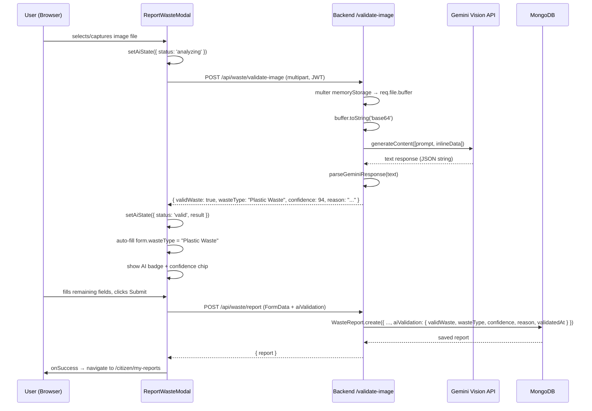
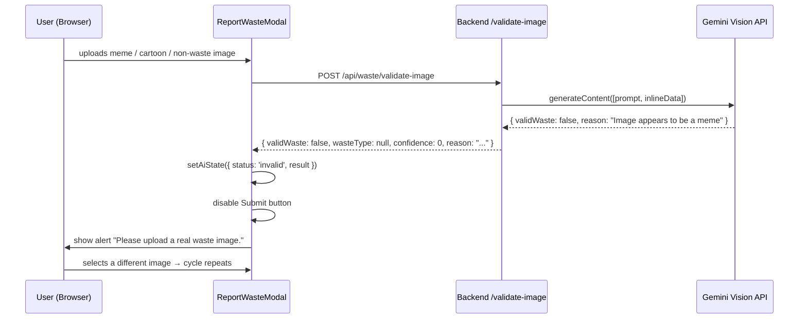
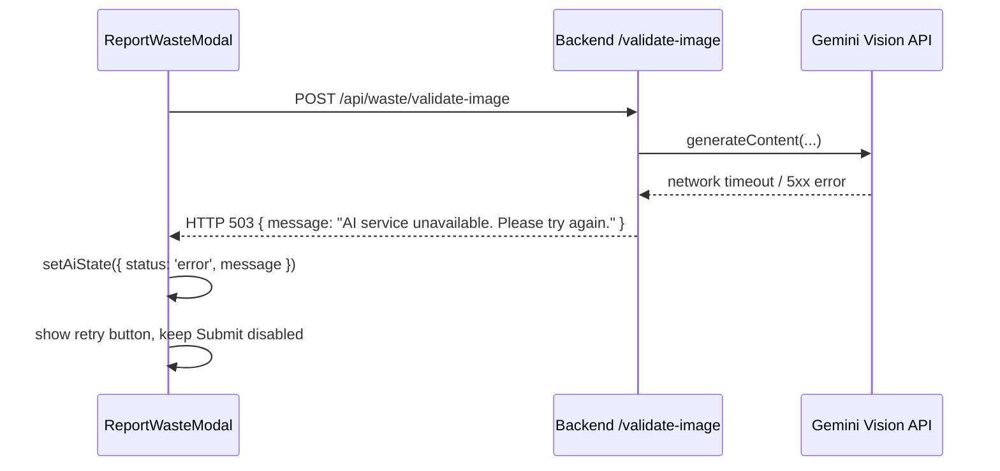

# Design Document: AI-Powered Waste Image Validation

## Overview

This feature integrates Google Gemini Vision API (gemini-1.5-flash) into the EcoLoop waste reporting flow to validate that uploaded images genuinely contain real-world waste before a report can be submitted. The backend receives the image, converts it to base64, calls Gemini, and returns a structured JSON result — the API key never leaves the server. On the frontend, the `ReportWasteModal` gains an AI verification step between image selection and form submission: a loading state while analysis runs, a badge showing the result, auto-fill of the detected waste category, and a confidence percentage display.

The feature also persists the AI validation result (`validWaste`, `wasteType`, `confidence`, `reason`, `validatedAt`) in a new `aiValidation` sub-document on the `WasteReport` Mongoose schema, giving admins and collectors full audit visibility into how each report was classified.

---

## Architecture

```mermaid
graph TD
    A[User: ReportWasteModal] -->|selects/captures image| B[handleImage]
    B -->|POST /api/waste/validate-image multipart| C[validateImageController]
    C -->|multer memoryStorage| D[image buffer in memory]
    D -->|buffer.toString base64| E[Gemini Vision API\ngemini-1.5-flash]
    E -->|JSON response| F[parseGeminiResponse]
    F -->|structured result| G[{ validWaste, wasteType, confidence, reason }]
    G -->|HTTP 200| A
    A -->|validWaste=false| H[Block submit\nShow alert]
    A -->|validWaste=true| I[Auto-fill wasteType\nShow badge + confidence]
    I -->|user clicks Submit| J[POST /api/waste/report]
    J -->|aiValidation payload| K[createReport\nWasteReport.create]
    K -->|saved with aiValidation sub-doc| L[(MongoDB WasteReport)]
```

---

## Sequence Diagrams

### Happy Path — Valid Waste Image



### Rejection Path — Invalid Image



### Error Path — API Failure / Timeout



---

## Components and Interfaces

### Component 1: `validateImageController` (Backend)

**Purpose**: Receives the uploaded image, converts it to base64, calls Gemini Vision API, parses the response, and returns a structured validation result.

**Interface**:
```javascript
// POST /api/waste/validate-image
// Request: multipart/form-data, field name: "image", Authorization: Bearer <JWT>
// Response 200:
{
  validWaste: Boolean,       // true if image contains real waste
  wasteType: String | null,  // one of WASTE_TYPES or null
  confidence: Number,        // 0–100
  reason: String             // human-readable explanation
}
// Response 400: { message: "No image file provided." }
// Response 503: { message: "AI service unavailable. Please try again." }
// Response 500: { message: "Server error.", error: String }
```

**Responsibilities**:
- Accept image via multer `memoryStorage` (no Cloudinary upload for validation — saves cost)
- Convert buffer to base64 inline data for Gemini
- Build a strict prompt that instructs Gemini to return only valid JSON
- Parse and sanitize Gemini's text response
- Map detected waste type to one of the five canonical `WASTE_TYPES`
- Return structured result; never expose the API key

### Component 2: `geminiService` (Backend utility)

**Purpose**: Encapsulates all Gemini SDK interactions, keeping the controller thin.

**Interface**:
```javascript
/**
 * @param {Buffer} imageBuffer - Raw image bytes
 * @param {string} mimeType    - e.g. "image/jpeg"
 * @returns {Promise<GeminiValidationResult>}
 */
async function analyzeWasteImage(imageBuffer, mimeType)

/**
 * @typedef {Object} GeminiValidationResult
 * @property {boolean}      validWaste
 * @property {string|null}  wasteType
 * @property {number}       confidence  - 0 to 100
 * @property {string}       reason
 */
```

**Responsibilities**:
- Initialize `GoogleGenerativeAI` with `process.env.GEMINI_API_KEY`
- Build the structured prompt
- Call `model.generateContent` with inline image data
- Extract and parse JSON from the response text
- Handle SDK errors and throw typed errors for the controller

### Component 3: `memoryUpload` middleware (Backend)

**Purpose**: A separate multer instance using `memoryStorage` specifically for the validation endpoint, so images are never uploaded to Cloudinary during validation.

**Interface**:
```javascript
// server/middleware/memoryUploadMiddleware.js
const memoryUpload = multer({
  storage: multer.memoryStorage(),
  limits: { fileSize: 5 * 1024 * 1024 },  // 5 MB
  fileFilter: (req, file, cb) => { /* accept only image/* */ }
})
module.exports = memoryUpload
```

### Component 4: AI Validation UI (Frontend — `ReportWasteModal`)

**Purpose**: Orchestrates the AI validation step within the existing report form, showing loading state, result badge, and blocking/allowing submission.

**Interface** (state additions to `ReportWasteModal`):
```javascript
const [aiState, setAiState] = useState({
  status: 'idle',       // 'idle' | 'analyzing' | 'valid' | 'invalid' | 'error'
  result: null,         // GeminiValidationResult | null
  message: '',          // error message string
})
```

**Responsibilities**:
- Trigger `validateImage(file)` immediately after `handleImage(file)` selects a file
- Show `<AIAnalyzingSpinner>` while `status === 'analyzing'`
- Show `<AIResultBadge>` with confidence chip when `status === 'valid'`
- Show alert banner and block submit when `status === 'invalid'`
- Show retry UI when `status === 'error'`
- Auto-fill `form.wasteType` from `result.wasteType` on valid result
- Pass `aiValidation` data in the `doSubmit` FormData payload

### Component 5: `AIResultBadge` (Frontend — new sub-component)

**Purpose**: Displays the AI verification result inline in the Photo section of the form.

**Interface**:
```jsx
<AIResultBadge
  status="valid" | "invalid" | "analyzing" | "error"
  wasteType="Plastic Waste"
  confidence={94}
  reason="Plastic bottles and garbage detected"
  dark={false}
/>
```

---

## Data Models

### Updated `WasteReport` Mongoose Schema

```javascript
// New sub-document added to server/models/WasteReport.js
aiValidation: {
  validWaste:   { type: Boolean,  default: null },
  wasteType:    { type: String,   default: null },
  confidence:   { type: Number,   default: null },  // 0–100
  reason:       { type: String,   default: '' },
  validatedAt:  { type: Date,     default: null },
}
```

**Validation Rules**:
- `confidence` must be between 0 and 100 (inclusive) when present
- `wasteType` must be one of `['Wet Waste', 'Dry Waste', 'E-Waste', 'Plastic Waste', 'Mixed Waste']` or `null`
- `validatedAt` is set server-side at the moment `createReport` processes the `aiValidation` payload

### Gemini Prompt Contract

The prompt sent to Gemini is a strict instruction that forces JSON-only output:

```
You are a waste detection AI for a civic waste management app.
Analyze the image and respond ONLY with a valid JSON object — no markdown, no explanation.

Rules:
- validWaste: true ONLY if the image shows real, physical waste/garbage in a real-world environment
- validWaste: false for: AI-generated images, cartoons, anime, screenshots, memes, internet/stock photos, non-waste subjects
- wasteType: one of ["Plastic Waste", "E-Waste", "Dry Waste", "Wet Waste", "Mixed Waste"] or null if validWaste is false
- confidence: integer 0–100 representing your certainty
- reason: one sentence explaining your decision

Respond with exactly this JSON structure:
{"validWaste": <boolean>, "wasteType": <string|null>, "confidence": <integer>, "reason": "<string>"}
```

### Frontend `aiValidation` Payload (sent with report submission)

```javascript
// Appended to FormData in doSubmit()
formData.append('aiValidation', JSON.stringify({
  validWaste:  aiState.result.validWaste,
  wasteType:   aiState.result.wasteType,
  confidence:  aiState.result.confidence,
  reason:      aiState.result.reason,
  validatedAt: new Date().toISOString(),
}))
```

---

## Algorithmic Pseudocode

### Main Validation Algorithm — `validateImageController`

```pascal
PROCEDURE validateImage(req, res)
  INPUT: req.file (multer memoryStorage), req.user (JWT decoded)
  OUTPUT: HTTP JSON response

  SEQUENCE
    IF req.file IS NULL THEN
      RETURN HTTP 400 { message: "No image file provided." }
    END IF

    imageBuffer ← req.file.buffer
    mimeType    ← req.file.mimetype

    TRY
      result ← await geminiService.analyzeWasteImage(imageBuffer, mimeType)
      RETURN HTTP 200 {
        validWaste: result.validWaste,
        wasteType:  result.wasteType,
        confidence: result.confidence,
        reason:     result.reason
      }
    CATCH GeminiAPIError
      RETURN HTTP 503 { message: "AI service unavailable. Please try again." }
    CATCH ParseError
      RETURN HTTP 500 { message: "Failed to parse AI response." }
    CATCH GenericError
      RETURN HTTP 500 { message: "Server error.", error: err.message }
    END TRY
  END SEQUENCE
END PROCEDURE
```

### Gemini Service Algorithm — `analyzeWasteImage`

```pascal
PROCEDURE analyzeWasteImage(imageBuffer, mimeType)
  INPUT: imageBuffer (Buffer), mimeType (String)
  OUTPUT: GeminiValidationResult

  SEQUENCE
    model ← GoogleGenerativeAI(GEMINI_API_KEY).getGenerativeModel("gemini-1.5-flash")

    base64Data ← imageBuffer.toString("base64")

    prompt ← buildValidationPrompt()   // strict JSON-only instruction

    inlineData ← { inlineData: { data: base64Data, mimeType: mimeType } }

    response ← await model.generateContent([prompt, inlineData])
    rawText  ← response.response.text()

    result ← parseGeminiJSON(rawText)

    RETURN result
  END SEQUENCE
END PROCEDURE

PROCEDURE parseGeminiJSON(rawText)
  INPUT: rawText (String) — may contain markdown fences
  OUTPUT: GeminiValidationResult

  SEQUENCE
    // Strip markdown code fences if present
    cleaned ← rawText.replace(/```json|```/g, "").trim()

    parsed ← JSON.parse(cleaned)

    // Sanitize and clamp values
    validWaste ← Boolean(parsed.validWaste)
    confidence ← Math.max(0, Math.min(100, parseInt(parsed.confidence) || 0))
    wasteType  ← IF validWaste AND parsed.wasteType IN WASTE_TYPES
                   THEN parsed.wasteType
                   ELSE null
    reason     ← String(parsed.reason || "")

    RETURN { validWaste, wasteType, confidence, reason }
  END SEQUENCE
END PROCEDURE
```

### Frontend Validation Flow — `validateImage` (in `ReportWasteModal`)

```pascal
PROCEDURE validateImage(file)
  INPUT: file (File object from input)
  OUTPUT: side-effects on aiState, form.wasteType

  SEQUENCE
    setAiState({ status: "analyzing", result: null, message: "" })

    token    ← localStorage.getItem("token")
    formData ← new FormData()
    formData.append("image", file)

    TRY
      response ← await fetch(API + "/api/waste/validate-image", {
        method:  "POST",
        headers: { Authorization: "Bearer " + token },
        body:    formData
      })

      data ← await response.json()

      IF NOT response.ok THEN
        setAiState({ status: "error", result: null, message: data.message })
        RETURN
      END IF

      IF data.validWaste = true THEN
        setAiState({ status: "valid", result: data, message: "" })
        set("wasteType", data.wasteType)   // auto-fill waste type
      ELSE
        setAiState({ status: "invalid", result: data, message: data.reason })
      END IF

    CATCH NetworkError
      setAiState({ status: "error", result: null, message: "Network error. Please try again." })
    END TRY
  END SEQUENCE
END PROCEDURE
```

### Updated `handleImage` Integration

```pascal
PROCEDURE handleImage(file)
  INPUT: file (File object)
  OUTPUT: side-effects on imageFile, preview, photoLoc, aiState

  SEQUENCE
    IF file IS NULL THEN RETURN END IF

    setImageFile(file)
    setPreview(URL.createObjectURL(file))

    exif ← await readExifLocation(file)
    IF exif IS NOT NULL THEN
      setPhotoLoc(exif)
      IF location IS NOT NULL THEN
        setPhotoWarning(haversineMeters(exif, location) > 200)
      END IF
    ELSE
      setPhotoLoc(null)
      setPhotoWarning(false)
    END IF

    // NEW: trigger AI validation immediately after image selection
    await validateImage(file)
  END SEQUENCE
END PROCEDURE
```

### Updated `doSubmit` — Append AI Validation

```pascal
PROCEDURE doSubmit()
  SEQUENCE
    // ... existing FormData construction ...

    IF aiState.result IS NOT NULL THEN
      formData.append("aiValidation", JSON.stringify({
        validWaste:  aiState.result.validWaste,
        wasteType:   aiState.result.wasteType,
        confidence:  aiState.result.confidence,
        reason:      aiState.result.reason,
        validatedAt: new Date().toISOString()
      }))
    END IF

    // ... existing fetch to /api/waste/report ...
  END SEQUENCE
END PROCEDURE
```

### Updated `validate()` — Block Invalid Images

```pascal
PROCEDURE validate()
  SEQUENCE
    e ← {}

    // ... existing validations ...

    IF aiState.status = "analyzing" THEN
      e.ai ← "Please wait for AI image analysis to complete."
    END IF

    IF aiState.status = "invalid" THEN
      e.ai ← "Please upload a real waste image."
    END IF

    IF aiState.status = "error" THEN
      e.ai ← "Image validation failed. Please re-upload your image."
    END IF

    IF imageFile IS NOT NULL AND aiState.status = "idle" THEN
      e.ai ← "Image has not been validated yet."
    END IF

    RETURN e
  END SEQUENCE
END PROCEDURE
```

---

## Key Functions with Formal Specifications

### `analyzeWasteImage(imageBuffer, mimeType)`

```javascript
async function analyzeWasteImage(imageBuffer, mimeType)
```

**Preconditions:**
- `imageBuffer` is a non-empty `Buffer` instance
- `mimeType` is one of `['image/jpeg', 'image/png', 'image/webp']`
- `process.env.GEMINI_API_KEY` is set and valid
- Network access to Gemini API is available

**Postconditions:**
- Returns a `GeminiValidationResult` object with all four fields populated
- `confidence` is always in range `[0, 100]`
- `wasteType` is `null` when `validWaste === false`
- `wasteType` is one of the five canonical waste types when `validWaste === true`
- Throws `GeminiAPIError` on SDK/network failure (never swallows errors silently)

**Loop Invariants:** N/A (no loops)

---

### `parseGeminiJSON(rawText)`

```javascript
function parseGeminiJSON(rawText)
```

**Preconditions:**
- `rawText` is a non-null string (may be empty or malformed)

**Postconditions:**
- Returns a valid `GeminiValidationResult` if parsing succeeds
- `confidence` is clamped to `[0, 100]` regardless of Gemini output
- `wasteType` is validated against `WASTE_TYPES` whitelist
- Throws `ParseError` if `rawText` cannot be parsed as JSON after stripping markdown fences

**Loop Invariants:** N/A

---

### `validateImage(file)` (Frontend)

```javascript
async function validateImage(file: File): Promise<void>
```

**Preconditions:**
- `file` is a valid `File` object with `size > 0`
- A valid JWT token exists in `localStorage`
- `API` base URL is configured

**Postconditions:**
- `aiState.status` transitions from `'analyzing'` to one of `'valid'`, `'invalid'`, or `'error'`
- If `status === 'valid'`: `form.wasteType` is set to `result.wasteType`
- If `status === 'invalid'`: `form.wasteType` is NOT auto-filled
- `aiState.result` is non-null when `status` is `'valid'` or `'invalid'`
- `aiState.message` contains a user-facing string when `status` is `'error'` or `'invalid'`

**Loop Invariants:** N/A

---

## Example Usage

### Backend — Calling the Validation Endpoint

```javascript
// Example: curl equivalent
// POST /api/waste/validate-image
// Headers: Authorization: Bearer <token>
// Body: multipart/form-data, field "image" = <file>

// Successful response (valid waste):
{
  "validWaste": true,
  "wasteType": "Plastic Waste",
  "confidence": 94,
  "reason": "Plastic bottles and garbage bags visible on roadside"
}

// Rejection response (invalid image):
{
  "validWaste": false,
  "wasteType": null,
  "confidence": 12,
  "reason": "Image appears to be a cartoon or animated content"
}
```

### Frontend — AI State Rendering Logic

```jsx
// Inside ReportWasteModal Photo section
{aiState.status === 'analyzing' && (
  <div className="flex items-center gap-2 text-sm text-blue-600">
    <Spinner className="h-4 w-4 animate-spin" />
    <span>AI is analyzing your image...</span>
  </div>
)}

{aiState.status === 'valid' && (
  <div className="flex items-center gap-2 rounded border border-green-200 bg-green-50 px-3 py-2">
    <HiCheckCircle className="h-4 w-4 text-green-600" />
    <span className="text-sm text-green-700 font-medium">
      AI Verified: {aiState.result.wasteType}
    </span>
    <span className="ml-auto text-xs text-green-600 font-bold">
      {aiState.result.confidence}% confidence
    </span>
  </div>
)}

{aiState.status === 'invalid' && (
  <div className="flex items-center gap-2 rounded border border-red-200 bg-red-50 px-3 py-2">
    <HiExclamation className="h-4 w-4 text-red-500" />
    <span className="text-sm text-red-700">
      Please upload a real waste image.
    </span>
  </div>
)}

{aiState.status === 'error' && (
  <div className="flex items-center gap-2 rounded border border-yellow-200 bg-yellow-50 px-3 py-2">
    <HiExclamation className="h-4 w-4 text-yellow-500" />
    <span className="text-sm text-yellow-700">{aiState.message}</span>
    <button onClick={() => validateImage(imageFile)} className="ml-auto text-xs underline">
      Retry
    </button>
  </div>
)}
```

### Backend — `createReport` aiValidation Parsing

```javascript
// In createReport controller, after existing field extraction:
let aiValidation = null;
if (req.body.aiValidation) {
  try {
    const parsed = JSON.parse(req.body.aiValidation);
    aiValidation = {
      validWaste:  Boolean(parsed.validWaste),
      wasteType:   parsed.wasteType || null,
      confidence:  Math.max(0, Math.min(100, Number(parsed.confidence) || 0)),
      reason:      String(parsed.reason || ''),
      validatedAt: parsed.validatedAt ? new Date(parsed.validatedAt) : new Date(),
    };
  } catch { /* aiValidation stays null */ }
}

// Then in WasteReport.create({ ..., aiValidation })
```

---

## Error Handling

### Error Scenario 1: No Image Provided

**Condition**: `POST /api/waste/validate-image` called without a file field  
**Response**: HTTP 400 `{ message: "No image file provided." }`  
**Recovery**: Frontend shows field-level error; user must select an image

### Error Scenario 2: Gemini API Key Missing / Invalid

**Condition**: `GEMINI_API_KEY` not set in `.env` or revoked  
**Response**: HTTP 503 `{ message: "AI service unavailable. Please try again." }`  
**Recovery**: Frontend shows error state with retry button; admin must fix `.env`

### Error Scenario 3: Gemini Returns Malformed JSON

**Condition**: Gemini response text is not parseable JSON (rare but possible)  
**Response**: HTTP 500 `{ message: "Failed to parse AI response." }`  
**Recovery**: Frontend shows error state; user can retry (next call may succeed)

### Error Scenario 4: Network Timeout

**Condition**: Gemini API call exceeds timeout (default ~30s)  
**Response**: HTTP 503 `{ message: "AI service unavailable. Please try again." }`  
**Recovery**: Frontend shows retry button; exponential backoff not required for MVP

### Error Scenario 5: Image Too Large

**Condition**: Uploaded file exceeds 5 MB multer limit  
**Response**: HTTP 400 (multer error) `{ message: "File too large." }`  
**Recovery**: Frontend shows size error; user must compress/re-select image

### Error Scenario 6: User Bypasses Validation (Submit Without AI Check)

**Condition**: User somehow submits without `aiValidation` in FormData (e.g., direct API call)  
**Response**: `createReport` accepts the report but `aiValidation` is stored as `null`  
**Recovery**: Admin can filter reports with `aiValidation: null` for manual review

---

## Testing Strategy

### Unit Testing Approach

Test `geminiService.parseGeminiJSON` in isolation with mocked inputs:
- Valid JSON string → correct `GeminiValidationResult`
- JSON wrapped in markdown fences → correctly stripped and parsed
- Malformed JSON → throws `ParseError`
- `confidence` out of range (e.g., 150) → clamped to 100
- `wasteType` not in whitelist → returns `null`
- `validWaste: false` with a wasteType → `wasteType` forced to `null`

Test `validateImageController` with mocked `geminiService`:
- Valid image + valid Gemini response → HTTP 200 with correct body
- No file → HTTP 400
- Gemini throws → HTTP 503

### Property-Based Testing Approach

**Property Test Library**: fast-check (JavaScript)

Properties to verify for `parseGeminiJSON`:
- For any string input, the function either returns a valid result or throws — never returns `undefined`
- For any parsed result, `confidence` is always in `[0, 100]`
- For any parsed result where `validWaste === false`, `wasteType` is always `null`
- For any parsed result where `validWaste === true`, `wasteType` is always one of the five canonical types or `null`

Properties to verify for `validateImage` (frontend):
- After any call completes, `aiState.status` is never `'analyzing'`
- If response `validWaste === true`, `form.wasteType` equals `result.wasteType`
- If response `validWaste === false`, `form.wasteType` is unchanged from its pre-call value

### Integration Testing Approach

- End-to-end: upload a real waste image → `POST /api/waste/validate-image` → verify structured JSON response
- End-to-end: upload a non-waste image → verify `validWaste: false` response
- Full flow: validate → submit report → verify `aiValidation` sub-document persisted in MongoDB

---

## Performance Considerations

- **Memory storage for validation**: Images are held in memory (not written to disk or Cloudinary) during the validation call, keeping latency low and avoiding unnecessary cloud storage costs for rejected images.
- **Gemini latency**: `gemini-1.5-flash` is optimized for speed (~1–3s typical). The frontend loading spinner covers this window.
- **No caching**: Each image is validated fresh. Caching by image hash is a future optimization if abuse patterns emerge.
- **File size limit**: 5 MB cap on `memoryUpload` prevents memory exhaustion from large uploads.
- **Sequential flow**: Validation happens before duplicate check and before final submission, so invalid images never reach the database.

---

## Security Considerations

- **API key isolation**: `GEMINI_API_KEY` is read only from `process.env` on the server. It is never sent to the frontend, never logged, and never included in any response body.
- **JWT protection**: `POST /api/waste/validate-image` uses the existing `protect` middleware — unauthenticated callers receive HTTP 401.
- **Input sanitization**: Gemini's response is parsed and each field is explicitly typed/clamped before being returned. No raw Gemini output is forwarded to the client.
- **File type filtering**: `memoryUpload` middleware rejects non-image MIME types before the buffer reaches `geminiService`.
- **No prompt injection risk**: The image is sent as binary inline data, not as text. The prompt is a hardcoded server-side string — users cannot influence it.
- **Rate limiting** (future): The `/api/waste/validate-image` endpoint should be rate-limited per user to prevent Gemini API quota exhaustion.

---

## Dependencies

| Dependency | Location | Purpose |
|---|---|---|
| `@google/generative-ai ^0.24.1` | `server/package.json` (already installed) | Gemini Vision API SDK |
| `multer ^2.1.1` | `server/package.json` (already installed) | `memoryStorage` for validation endpoint |
| `dotenv ^17.3.1` | `server/package.json` (already installed) | Load `GEMINI_API_KEY` from `.env` |
| `react-icons/hi` | `client` (already installed) | UI icons for AI badge |
| `GEMINI_API_KEY` | `server/.env` (to be added) | Google Gemini API key — backend only |
