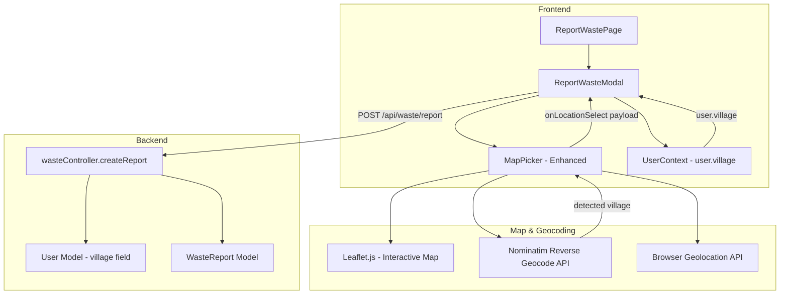
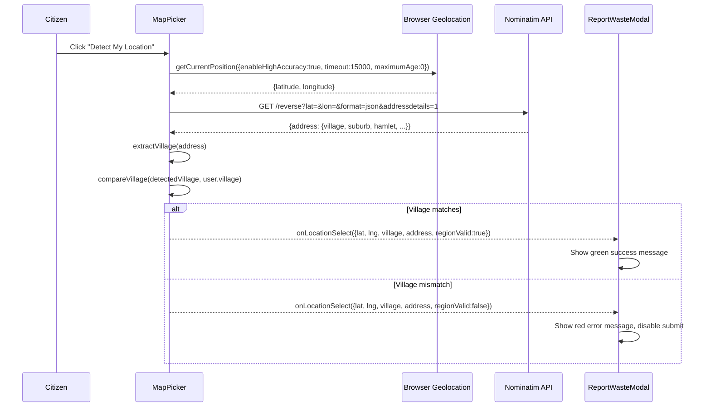
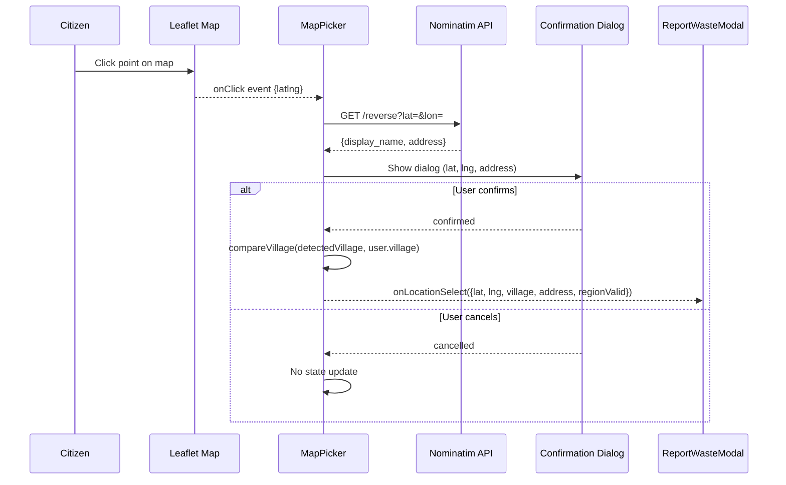
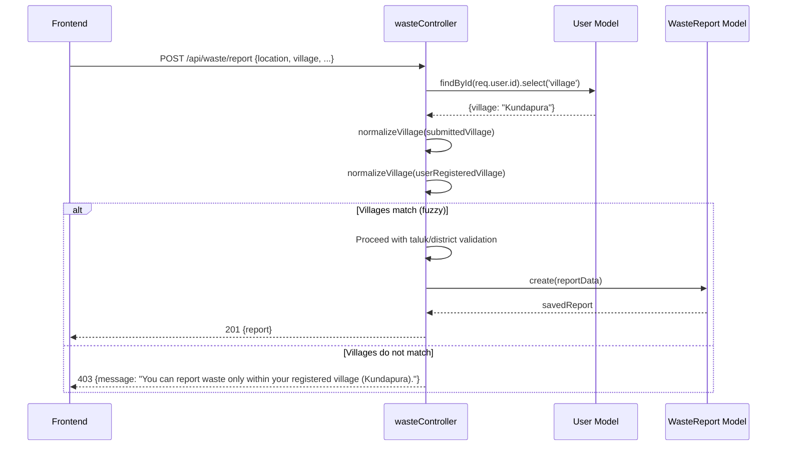

# Design Document: Citizen Waste Reporting Enhancement

## Overview

This enhancement upgrades the Citizen Waste Reporting module to enforce village-level service area restrictions, improve location accuracy, enable interactive map-click selection, and auto-fill address fields from reverse geocoding. The feature closes the current gap where only taluk-level validation is performed, replacing it with per-village validation on both the frontend and backend, using the citizen's registered village from `UserContext`.

The solution replaces the static OpenStreetMap iframe in `MapPicker.jsx` with an interactive Leaflet-based map that supports click-to-place-marker, upgrades geolocation timeout to 15 seconds, adds a confirmation dialog for map-click selections, and enforces village matching via Nominatim reverse geocoding. Backend validation in `wasteController.js` is extended to compare the submitted village against the authenticated user's registered village.

---

## Architecture



---

## Sequence Diagrams

### Flow 1: Detect My Location



### Flow 2: Click on Map



### Flow 3: Backend Village Validation



---

## Components and Interfaces

### Component 1: MapPicker (Enhanced)

**Purpose**: Interactive map with Leaflet.js replacing the static OSM iframe. Supports click-to-place-marker, detect location, search address, and village-level validation.

**Props Interface**:
```javascript
/**
 * @param {object} props
 * @param {function} props.onLocationSelect - Callback with location payload
 * @param {string}   props.registeredVillage - User's registered village from UserContext
 * @param {boolean}  [props.dark=false] - Dark mode flag
 */
const MapPicker = ({ onLocationSelect, registeredVillage, dark = false }) => { ... }
```

**`onLocationSelect` Payload**:
```javascript
{
  lat: number,              // WGS84 latitude
  lng: number,              // WGS84 longitude
  address: string,          // Full Nominatim display_name
  displayAddress: string,   // Shortened human-readable address
  village: string,          // Detected village from reverse geocode
  area: string,             // neighbourhood / suburb
  city: string,             // town / city
  district: string,         // state_district / district
  state: string,
  country: string,
  pincode: string,
  regionValid: boolean,     // true if detectedVillage matches registeredVillage
}
```

**Responsibilities**:
- Render Leaflet map centered on Kundapura Taluk (13.3409, 74.7421)
- Handle "Detect My Location" with `{ enableHighAccuracy: true, timeout: 15000, maximumAge: 0 }`
- Handle map click → show confirmation dialog → call `onLocationSelect`
- Handle search address via Nominatim search API
- Extract village from Nominatim `address.village || address.suburb || address.neighbourhood || address.hamlet`
- Compare detected village with `registeredVillage` (case-insensitive, partial/fuzzy match)
- Display green success or red error validation message
- Show coordinates below map after selection
- Auto-fill address fields via callback payload

### Component 2: LocationConfirmDialog

**Purpose**: Modal dialog shown after map click to confirm or cancel the selected location.

**Props Interface**:
```javascript
/**
 * @param {object}   props
 * @param {number}   props.lat
 * @param {number}   props.lng
 * @param {string}   props.address
 * @param {function} props.onConfirm
 * @param {function} props.onCancel
 * @param {boolean}  [props.dark=false]
 */
const LocationConfirmDialog = ({ lat, lng, address, onConfirm, onCancel, dark }) => { ... }
```

**Responsibilities**:
- Display lat/lng and address of clicked point
- Provide "Use this location" (confirm) and "Cancel" buttons
- Block form interaction while open

### Component 3: ReportWasteModal (Modified)

**Purpose**: Main report form. Passes `registeredVillage` to `MapPicker`, reads `user.village` from `UserContext`, displays service area banner, enforces village-level `regionValid` for submit button.

**Key Changes**:
- Read `user.village` from `useUser()` hook
- Pass `registeredVillage={user?.village}` to `MapPicker`
- Display service area banner: `"Service Area: <Village>, Kundapura Taluk, Udupi District, Karnataka"`
- Village field in manual entry: auto-filled from `user.village`, `readOnly`
- Submit button disabled when `regionValid === false`
- Auto-fill `houseNo`, `street`, `landmark`, `wardNumber` from `onLocationSelect` payload

---

## Data Models

### Frontend Location Payload (Extended)

```javascript
// Passed via onLocationSelect callback
const locationPayload = {
  lat: 13.3409,
  lng: 74.7421,
  address: "Kundapura, Udupi District, Karnataka, India",
  displayAddress: "Kundapura, Udupi, Karnataka",
  village: "Kundapura",       // NEW: village-level field
  area: "Kundapura",
  city: "Kundapura",
  district: "Udupi",
  state: "Karnataka",
  country: "India",
  pincode: "576201",
  regionValid: true,           // NEW: village-level validation result
}
```

### Backend WasteReport Model (No Schema Change Required)

The existing `WasteReport` schema already has `village`, `houseNo`, `street`, `landmark`, `wardNumber`, and `location` (GeoJSON Point) fields. No schema migration is needed.

**Validation Rules**:
- `village`: Must match authenticated user's registered village (case-insensitive, fuzzy)
- `location.lat` / `location.lng`: Must be non-zero when `locMethod === 'map'`
- `houseNo`, `street`, `wardNumber`: Required for both map and manual modes
- `location.address`: Must contain "kundapura" or "udupi" (existing taluk check retained)

---

## Algorithmic Pseudocode

### Algorithm 1: Village Extraction from Nominatim Response

```pascal
FUNCTION extractVillage(nominatimAddress)
  INPUT: nominatimAddress — address object from Nominatim reverse geocode
  OUTPUT: village — string (may be empty)

  BEGIN
    // Priority order: village > suburb > neighbourhood > hamlet > town
    IF nominatimAddress.village IS NOT EMPTY THEN
      RETURN nominatimAddress.village
    END IF
    IF nominatimAddress.suburb IS NOT EMPTY THEN
      RETURN nominatimAddress.suburb
    END IF
    IF nominatimAddress.neighbourhood IS NOT EMPTY THEN
      RETURN nominatimAddress.neighbourhood
    END IF
    IF nominatimAddress.hamlet IS NOT EMPTY THEN
      RETURN nominatimAddress.hamlet
    END IF
    IF nominatimAddress.town IS NOT EMPTY THEN
      RETURN nominatimAddress.town
    END IF
    RETURN ''
  END
END FUNCTION
```

**Preconditions:**
- `nominatimAddress` is a valid object (may have empty fields)

**Postconditions:**
- Returns the most specific locality name available, or empty string
- No mutations to input

### Algorithm 2: Village Match Validation

```pascal
FUNCTION villagesMatch(detectedVillage, registeredVillage)
  INPUT: detectedVillage — string from reverse geocode
         registeredVillage — string from user profile
  OUTPUT: isMatch — boolean

  BEGIN
    IF detectedVillage IS EMPTY OR registeredVillage IS EMPTY THEN
      RETURN false
    END IF

    detected   ← LOWERCASE(TRIM(detectedVillage))
    registered ← LOWERCASE(TRIM(registeredVillage))

    // Exact match
    IF detected EQUALS registered THEN
      RETURN true
    END IF

    // Partial containment (handles "Kundapura Town" vs "Kundapura")
    IF detected CONTAINS registered OR registered CONTAINS detected THEN
      RETURN true
    END IF

    RETURN false
  END
END FUNCTION
```

**Preconditions:**
- Both inputs are strings (may be empty)

**Postconditions:**
- Returns `true` only when villages are the same locality (exact or partial match)
- Case-insensitive comparison
- No side effects

**Loop Invariants:** N/A (no loops)

### Algorithm 3: Reverse Geocode and Validate Location

```pascal
ASYNC FUNCTION reverseGeocodeAndValidate(lat, lng, registeredVillage)
  INPUT: lat, lng — WGS84 coordinates
         registeredVillage — user's registered village string
  OUTPUT: locationData — object with address fields and regionValid flag

  BEGIN
    ASSERT lat IS VALID_LATITUDE AND lng IS VALID_LONGITUDE

    response ← AWAIT fetch(
      `https://nominatim.openstreetmap.org/reverse?lat=${lat}&lon=${lng}&format=json&addressdetails=1`,
      { headers: { 'Accept-Language': 'en' } }
    )

    IF response IS NOT OK THEN
      RETURN { address: `${lat}, ${lng}`, regionValid: false, village: '' }
    END IF

    data ← AWAIT response.json()
    addr ← data.address OR {}

    detectedVillage ← extractVillage(addr)
    isMatch         ← villagesMatch(detectedVillage, registeredVillage)

    parts ← FILTER_EMPTY([
      detectedVillage,
      addr.town OR addr.city OR addr.county,
      addr.state_district OR addr.district,
      addr.state,
      addr.country
    ])

    RETURN {
      address:        data.display_name OR `${lat}, ${lng}`,
      displayAddress: JOIN(parts, ', ') OR data.display_name,
      village:        detectedVillage,
      area:           addr.neighbourhood OR addr.suburb OR addr.village OR '',
      city:           addr.town OR addr.city OR addr.county OR '',
      district:       addr.state_district OR addr.district OR '',
      state:          addr.state OR '',
      country:        addr.country OR '',
      pincode:        addr.postcode OR '',
      regionValid:    isMatch,
    }
  END
END FUNCTION
```

**Preconditions:**
- `lat` ∈ [-90, 90], `lng` ∈ [-180, 180]
- `registeredVillage` is a non-empty string

**Postconditions:**
- Returns a complete location data object
- `regionValid` is `true` iff detected village matches registered village
- On network failure, returns fallback with `regionValid: false`

**Loop Invariants:** N/A

### Algorithm 4: Backend Village Validation (wasteController)

```pascal
ASYNC FUNCTION validateVillageOnBackend(req, res, next)
  INPUT: req.body.village — village submitted by frontend
         req.user.id — authenticated user ID
  OUTPUT: calls next() if valid, returns 403 if invalid

  BEGIN
    userRecord ← AWAIT User.findById(req.user.id).select('village')

    IF userRecord IS NULL THEN
      RETURN res.status(401).json({ message: 'User not found.' })
    END IF

    submittedVillage  ← LOWERCASE(TRIM(req.body.village OR ''))
    registeredVillage ← LOWERCASE(TRIM(userRecord.village OR ''))

    IF registeredVillage IS EMPTY THEN
      // No village restriction for users without a registered village
      CALL next()
      RETURN
    END IF

    isMatch ← submittedVillage EQUALS registeredVillage
              OR submittedVillage CONTAINS registeredVillage
              OR registeredVillage CONTAINS submittedVillage

    IF NOT isMatch THEN
      RETURN res.status(403).json({
        message: `You can report waste only within your registered village (${userRecord.village}).`
      })
    END IF

    CALL next()
  END
END FUNCTION
```

**Preconditions:**
- `req.user.id` is a valid authenticated user ID (JWT middleware has run)
- `req.body.village` is a string (may be empty)

**Postconditions:**
- If user has no registered village: passes through (no restriction)
- If submitted village matches registered village: passes through
- If mismatch: returns HTTP 403 with descriptive error message
- Does not mutate request body

**Loop Invariants:** N/A

---

## Key Functions with Formal Specifications

### `extractVillage(address)`

```javascript
/**
 * Extracts the most specific village/locality name from a Nominatim address object.
 * @param {object} address - Nominatim address object
 * @returns {string} village name or empty string
 */
function extractVillage(address) {
  return address.village
    || address.suburb
    || address.neighbourhood
    || address.hamlet
    || address.town
    || '';
}
```

**Preconditions:** `address` is an object (not null)
**Postconditions:** Returns a string; never throws; no side effects

---

### `villagesMatch(detected, registered)`

```javascript
/**
 * Case-insensitive partial match between two village name strings.
 * @param {string} detected - Village from reverse geocode
 * @param {string} registered - Village from user profile
 * @returns {boolean}
 */
function villagesMatch(detected, registered) {
  if (!detected || !registered) return false;
  const d = detected.trim().toLowerCase();
  const r = registered.trim().toLowerCase();
  return d === r || d.includes(r) || r.includes(d);
}
```

**Preconditions:** Both params are strings (may be empty/null)
**Postconditions:** Returns boolean; symmetric for exact matches; no side effects

---

### `reverseGeocodeAndValidate(lat, lng, registeredVillage)`

```javascript
/**
 * Calls Nominatim reverse geocode and validates village against registered village.
 * @param {number} lat
 * @param {number} lng
 * @param {string} registeredVillage
 * @returns {Promise<LocationPayload>}
 */
async function reverseGeocodeAndValidate(lat, lng, registeredVillage) { ... }
```

**Preconditions:** `lat` ∈ [-90,90], `lng` ∈ [-180,180], `registeredVillage` is string
**Postconditions:** Always resolves (never rejects); `regionValid` reflects village match; fallback on network error

---

### `handleMapClick(latlng, registeredVillage, setConfirmDialog)`

```javascript
/**
 * Handles Leaflet map click: reverse geocodes and shows confirmation dialog.
 * @param {L.LatLng} latlng - Leaflet LatLng object
 * @param {string}   registeredVillage
 * @param {function} setConfirmDialog - React state setter for dialog data
 */
async function handleMapClick(latlng, registeredVillage, setConfirmDialog) { ... }
```

**Preconditions:** `latlng` is a valid Leaflet LatLng; `setConfirmDialog` is a function
**Postconditions:** Sets dialog state with geocoded data; does not update selected location until user confirms

---

## Example Usage

### MapPicker Integration in ReportWasteModal

```javascript
import { useUser } from '../context/UserContext';
import MapPicker from './MapPicker';

const ReportWasteModal = ({ isOpen, onClose, onSuccess, dark = false }) => {
  const { user } = useUser();
  const [location, setLocation] = useState(null);
  const [regionValid, setRegionValid] = useState(null);
  const [form, setForm] = useState({
    houseNo: '', street: '', landmark: '', wardNumber: '',
    // ...other fields
  });

  const handleLocationSelect = (loc) => {
    setLocation(loc);
    setRegionValid(loc.regionValid);
    // Auto-fill address fields from geocode result
    setForm(f => ({
      ...f,
      houseNo:    f.houseNo    || '',   // user can edit
      street:     loc.area     || f.street,
      landmark:   f.landmark   || '',
      wardNumber: f.wardNumber || '',
    }));
  };

  return (
    <>
      {/* Service Area Banner */}
      <p className="text-xs text-green-700">
        Service Area: {user?.village}, Kundapura Taluk, Udupi District, Karnataka
      </p>

      {/* Village field — read-only */}
      <input
        type="text"
        value={user?.village || ''}
        readOnly
        className="opacity-70 cursor-not-allowed"
      />

      {/* Map Picker with village prop */}
      <MapPicker
        onLocationSelect={handleLocationSelect}
        registeredVillage={user?.village}
        dark={dark}
      />

      {/* Submit — disabled when outside village */}
      <button
        type="submit"
        disabled={loading || regionValid === false}
      >
        {regionValid === false ? 'Outside Service Area' : 'Submit Report'}
      </button>
    </>
  );
};
```

### Village Validation in MapPicker

```javascript
// After reverse geocoding any location method:
const data = await reverseGeocodeAndValidate(lat, lng, registeredVillage);

if (data.regionValid) {
  // Show green success message
  setValidationMsg({ type: 'success', text: `Location is within ${registeredVillage}.` });
} else {
  // Show red error message
  setValidationMsg({
    type: 'error',
    text: `You can report waste only within your registered village (${registeredVillage}).`
  });
}

onLocationSelect({ lat, lng, ...data });
```

### Confirmation Dialog Usage

```javascript
// On Leaflet map click:
map.on('click', async (e) => {
  const data = await reverseGeocodeAndValidate(e.latlng.lat, e.latlng.lng, registeredVillage);
  setConfirmDialog({
    lat: e.latlng.lat,
    lng: e.latlng.lng,
    address: data.displayAddress || data.address,
    data,
  });
});

// Dialog confirm handler:
const handleConfirm = () => {
  placeMarker(confirmDialog.lat, confirmDialog.lng);
  onLocationSelect({ lat: confirmDialog.lat, lng: confirmDialog.lng, ...confirmDialog.data });
  setConfirmDialog(null);
};
```

---

## Correctness Properties

- **Village Restriction**: For all submitted reports, `report.village` must match the authenticated user's registered `user.village` (case-insensitive, partial match). Reports with mismatched villages are rejected with HTTP 403.
- **Read-Only Village Field**: The village input in the form is always populated from `user.village` and is `readOnly`; it cannot be modified by the citizen.
- **Submit Disabled on Invalid Region**: The submit button is disabled (`disabled={regionValid === false}`) whenever the selected location's detected village does not match the registered village.
- **Confirmation Before Map-Click Commit**: A location selected by clicking the map is never committed to form state without explicit user confirmation via the dialog.
- **Geolocation Freshness**: All `getCurrentPosition` calls use `{ maximumAge: 0 }` ensuring no cached coordinates are used.
- **Fallback on Geocode Failure**: If Nominatim reverse geocoding fails (network error), `regionValid` defaults to `false`, preventing submission.
- **Backend Bypass Prevention**: Even if frontend validation is bypassed, the backend re-validates village by fetching the user record from the database and comparing against the submitted village.
- **Taluk Validation Retained**: Existing Kundapura Taluk / Udupi District / Karnataka checks in `wasteController.js` are preserved alongside the new village-level check.

---

## Error Handling

### Error Scenario 1: Geolocation Permission Denied

**Condition**: User denies browser location permission
**Response**: Display error message "Location permission denied. Please allow access in browser settings."
**Recovery**: User can still use Search Address or Pick Location on Map

### Error Scenario 2: Location Outside Registered Village

**Condition**: Reverse geocode returns a village that does not match `user.village`
**Response**: Show red banner: "You can report waste only within your registered village (`<Village Name>`)." Disable submit button.
**Recovery**: User must select a location within their registered village

### Error Scenario 3: Nominatim API Failure

**Condition**: Network error or Nominatim returns non-OK response
**Response**: `regionValid` set to `false`; show error "Could not verify location. Please try again."
**Recovery**: User can retry detection or search

### Error Scenario 4: Backend Village Mismatch (Bypass Attempt)

**Condition**: Frontend validation bypassed; submitted village does not match user's registered village in DB
**Response**: HTTP 403 `{ message: "You can report waste only within your registered village (Kundapura)." }`
**Recovery**: Client must resubmit with correct village

### Error Scenario 5: Map Click Without Confirmation

**Condition**: User clicks map but cancels the confirmation dialog
**Response**: Marker is not placed; form location state is not updated; previous selection (if any) is preserved
**Recovery**: User can click again or use other location methods

---

## Testing Strategy

### Unit Testing Approach

Test pure utility functions in isolation:
- `extractVillage(address)`: Test all priority fields (village, suburb, neighbourhood, hamlet, town), empty object, missing fields
- `villagesMatch(detected, registered)`: Test exact match, partial match both directions, case variations, empty strings, null inputs
- `reverseGeocodeAndValidate`: Mock `fetch`; test success path, network failure, missing village in response

### Property-Based Testing Approach

**Property Test Library**: fast-check

```javascript
// Property: villagesMatch is case-insensitive
fc.assert(fc.property(fc.string(), (village) =>
  villagesMatch(village.toUpperCase(), village.toLowerCase()) ===
  villagesMatch(village.toLowerCase(), village.toLowerCase())
));

// Property: villagesMatch(x, x) is always true for non-empty strings
fc.assert(fc.property(fc.string({ minLength: 1 }), (village) =>
  villagesMatch(village, village) === true
));

// Property: villagesMatch('', x) is always false
fc.assert(fc.property(fc.string(), (village) =>
  villagesMatch('', village) === false
));

// Property: extractVillage never throws for any object shape
fc.assert(fc.property(fc.object(), (addr) => {
  expect(() => extractVillage(addr)).not.toThrow();
}));
```

### Integration Testing Approach

- Submit a report with a location in the registered village → expect 201
- Submit a report with a location outside the registered village → expect 403
- Submit with `village` field tampered to a different village → expect 403 from backend
- Detect location → verify `regionValid` reflects correct village comparison
- Map click → confirm dialog → verify location committed to form
- Map click → cancel dialog → verify form location unchanged

---

## Performance Considerations

- Nominatim reverse geocode calls are debounced for search input (350ms). For detect/click, they fire immediately but are single-shot (no polling).
- Nominatim has a usage policy of 1 request/second. The three location methods (detect, search, click) are user-triggered, so rate limiting is naturally respected.
- Leaflet.js (~40KB gzipped) replaces the OSM iframe embed. It should be lazy-loaded or code-split to avoid impacting initial bundle size.
- The confirmation dialog prevents accidental rapid map clicks from triggering multiple geocode requests simultaneously.

---

## Security Considerations

- **Village Spoofing Prevention**: The backend fetches `user.village` directly from the database using the authenticated JWT's user ID. The `village` field in the request body is compared against the DB value, not trusted as authoritative.
- **JWT Authentication**: All `/api/waste/report` requests require a valid JWT. The `req.user.id` is extracted from the verified token, not from the request body.
- **Input Sanitization**: Village strings are trimmed and lowercased before comparison. No SQL/NoSQL injection risk as Mongoose uses parameterized queries.
- **Nominatim Attribution**: Nominatim (OpenStreetMap) is already used in the existing `MapPicker.jsx`. Usage must comply with the [Nominatim Usage Policy](https://operations.osmfoundation.org/policies/nominatim/) — no bulk geocoding, proper `User-Agent` header recommended.
- **CORS**: Nominatim requests are made from the browser (client-side fetch), not the server, so no server-side proxy is needed for this use case.

---

## Dependencies

| Dependency | Purpose | Already Installed |
|---|---|---|
| `leaflet` | Interactive map with click support | No — needs install |
| `react-leaflet` | React bindings for Leaflet | No — needs install |
| `leaflet/dist/leaflet.css` | Leaflet default styles | No — import after install |
| Nominatim API | Reverse geocoding (free, OSM-based) | Yes — used in MapPicker.jsx |
| Browser Geolocation API | GPS coordinates | Yes — used in MapPicker.jsx |
| `UserContext` (`user.village`) | Registered village for validation | Yes — available in ReportWasteModal |
| `fast-check` | Property-based testing | Check package.json |

**Install command**:
```bash
cd client && npm install leaflet react-leaflet
```
