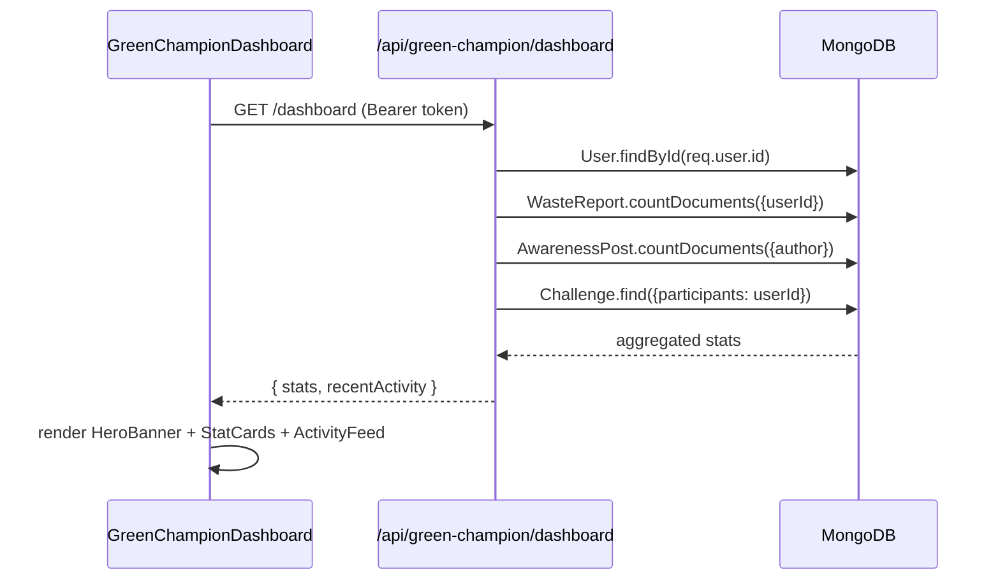
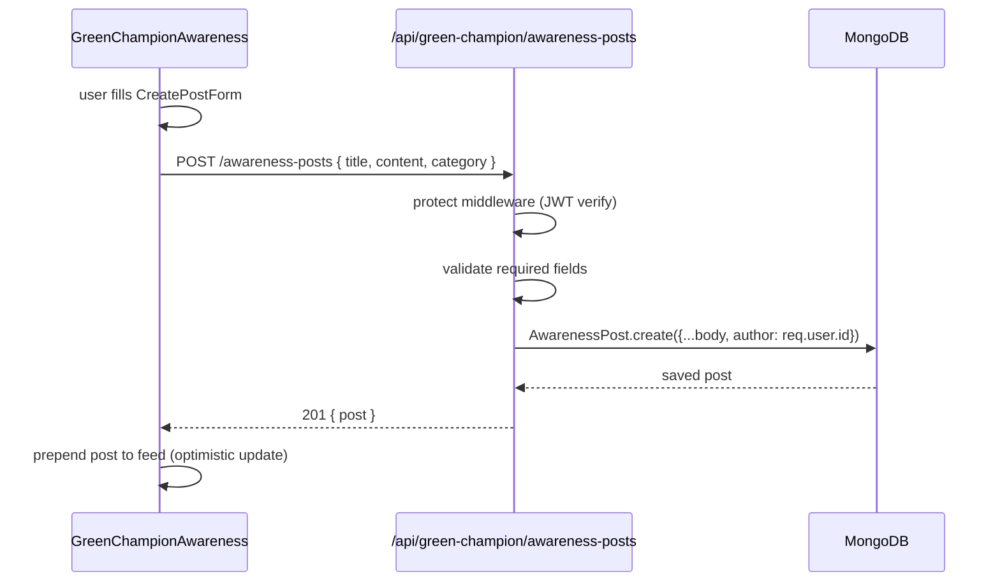
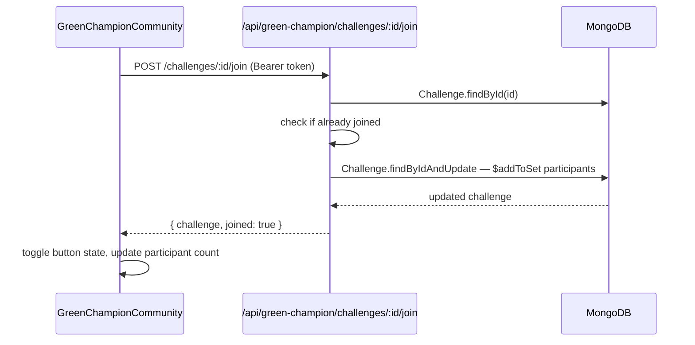

# Design Document: Green Champion Features

## Overview

The Green Champion role in EcoLoop is a community leadership tier that bridges individual eco-action and collective impact. Currently all four pages (Dashboard, Awareness, Community, Profile) are empty stubs. This feature fills them with fully functional UI and a new `/api/green-champion` backend namespace, adding two new Mongoose models (`AwarenessPost`, `Challenge`) while reusing existing infrastructure (JWT auth middleware, `User`, `WasteReport`, leaderboard route, rewards controller, `useTheme`/`useUser` contexts, Tailwind + react-icons/hi design language).

The design follows the same visual conventions already established in `CitizenDashboard` and `CitizenProfile`: gradient hero banners, stat cards with dot-pattern overlays, `rounded-sm` card borders, `dk(dark, light)` helper for dark-mode classes, and `fetch` calls with `Authorization: Bearer <token>` headers against the `API` constant.

---

## Architecture

```mermaid
graph TD
    subgraph Client ["Client (React + Vite)"]
        GCL[GreenChampionLayout]
        GCL --> DASH[GreenChampionDashboard]
        GCL --> AWR[GreenChampionAwareness]
        GCL --> COM[GreenChampionCommunity]
        GCL --> PRO[GreenChampionProfile]

        DASH --> SC[StatCards]
        DASH --> AF[ActivityFeed]
        DASH --> QA[QuickActions]
        DASH --> HB[HeroBanner]

        AWR --> PF[PostFeed]
        AWR --> CF[CreatePostForm]
        AWR --> CAT[CategoryFilter]

        COM --> CL[ChallengeList]
        COM --> MLB[MiniLeaderboard]

        PRO --> PI[ProfileInfo + EditForm]
        PRO --> BS[BadgeShowcase]
        PRO --> IS[ImpactStats]
    end

    subgraph Server ["Server (Express + MongoDB)"]
        GCR[/api/green-champion]
        GCR --> DAPI[GET /dashboard]
        GCR --> AAPI[GET /awareness-posts]
        GCR --> CPOST[POST /awareness-posts]
        GCR --> LAPI[POST /awareness-posts/:id/like]
        GCR --> CHAPI[GET /challenges]
        GCR --> JAPI[POST /challenges/:id/join]
        GCR --> LAPI2[POST /challenges/:id/leave]
        GCR --> PAPI[GET /profile]
        GCR --> PUAPI[PUT /profile]
    end

    subgraph Models
        AP[(AwarenessPost)]
        CH[(Challenge)]
        US[(User)]
        WR[(WasteReport)]
    end

    DASH -- "GET /api/green-champion/dashboard" --> DAPI
    AWR  -- "GET/POST /api/green-champion/awareness-posts" --> AAPI
    AWR  -- "POST /api/green-champion/awareness-posts/:id/like" --> LAPI
    COM  -- "GET /api/green-champion/challenges" --> CHAPI
    COM  -- "POST /api/green-champion/challenges/:id/join|leave" --> JAPI
    COM  -- "GET /api/leaderboard" --> MLB
    PRO  -- "GET/PUT /api/green-champion/profile" --> PAPI

    DAPI --> US
    DAPI --> WR
    AAPI --> AP
    CPOST --> AP
    LAPI --> AP
    CHAPI --> CH
    JAPI --> CH
    PAPI --> US
```

---

## Sequence Diagrams

### Dashboard Load



### Create Awareness Post



### Join Challenge



---

## Components and Interfaces

### GreenChampionDashboard

**Purpose**: Entry point for the Green Champion. Shows personal impact at a glance, recent activity, and quick navigation shortcuts.

**Interface**:
```typescript
interface DashboardStats {
  postsCount: number;
  challengesJoined: number;
  ecoPoints: number;
  streakCount: number;
}

interface ActivityItem {
  _id: string;
  type: 'post' | 'challenge_join' | 'like_received';
  message: string;
  createdAt: string;
}

interface DashboardResponse {
  stats: DashboardStats;
  recentActivity: ActivityItem[];
}
```

**Responsibilities**:
- Fetch `/api/green-champion/dashboard` on mount
- Render `HeroBanner` with greeting and CTA buttons
- Render 4 `StatCard` components (Posts, Challenges, EcoPoints, Streak)
- Render `ActivityFeed` (last 5 activity items)
- Render `QuickActions` grid (links to Awareness, Community, Profile)
- Show `Skeleton` loaders while fetching (reuse `DashboardSkeleton` pattern)

---

### GreenChampionAwareness

**Purpose**: Lets Green Champions publish and browse awareness posts on eco topics.

**Interface**:
```typescript
interface AwarenessPost {
  _id: string;
  title: string;
  content: string;
  category: 'Recycling' | 'Composting' | 'Plastic-Free' | 'Water Conservation' | 'Energy Saving' | 'General';
  author: { _id: string; name: string; profilePhoto: string };
  likes: string[];          // array of user IDs
  likesCount: number;
  createdAt: string;
}

interface CreatePostPayload {
  title: string;
  content: string;
  category: string;
}
```

**Responsibilities**:
- Fetch all posts on mount; support category filter
- Render `CreatePostForm` (collapsible panel, visible to GreenChampion only)
- Render `PostCard` list with like toggle
- Optimistically update like count on toggle
- Show empty state when no posts exist

---

### GreenChampionCommunity

**Purpose**: Displays active eco-challenges and a mini leaderboard.

**Interface**:
```typescript
interface Challenge {
  _id: string;
  title: string;
  description: string;
  category: string;
  startDate: string;
  endDate: string;
  participants: string[];   // array of user IDs
  participantCount: number;
  isActive: boolean;
  createdBy: string;
}

interface LeaderboardEntry {
  _id: string;
  name: string;
  ecoPoints: number;
  rank: number;
  topBadge: string | null;
}
```

**Responsibilities**:
- Fetch challenges from `/api/green-champion/challenges`
- Fetch top-5 leaderboard from `/api/leaderboard`
- Render `ChallengeCard` with join/leave toggle per card
- Render `MiniLeaderboard` (top 5 + current user row)
- Disable join button when challenge is expired

---

### GreenChampionProfile

**Purpose**: Full profile page with editable personal info, badge showcase, and impact stats.

**Interface**:
```typescript
interface ProfileForm {
  name: string;
  email: string;
  phone: string;
  locality: string;
  village: string;
  bio: string;             // new field for Green Champions
}

interface Badge {
  id: string;
  label: string;
  description: string;
  earned: boolean;
  icon: ReactNode;
}

interface ImpactStats {
  postsCount: number;
  challengesJoined: number;
  ecoPoints: number;
  totalReports: number;
}
```

**Responsibilities**:
- Load profile from `/api/green-champion/profile` (falls back to `useUser` context)
- Render hero banner with avatar picker (reuse `CitizenProfile` avatar picker pattern)
- Render editable `PersonalInfoForm` (name, phone, locality, bio)
- Render `BadgeShowcase` grid (4 badges: First Post, Active Champion, Community Leader, Eco Warrior)
- Render `ImpactStats` progress bars
- Save via `PUT /api/green-champion/profile`

---

## Data Models

### AwarenessPost

```javascript
// server/models/AwarenessPost.js
{
  title:    { type: String, required: true, trim: true, maxlength: 120 },
  content:  { type: String, required: true, trim: true, maxlength: 2000 },
  category: {
    type: String,
    enum: ['Recycling', 'Composting', 'Plastic-Free', 'Water Conservation', 'Energy Saving', 'General'],
    default: 'General'
  },
  author:   { type: ObjectId, ref: 'User', required: true },
  likes:    [{ type: ObjectId, ref: 'User' }],
  isPublished: { type: Boolean, default: true },
},
{ timestamps: true }
```

**Validation Rules**:
- `title` is required, max 120 characters
- `content` is required, max 2000 characters
- `category` must be one of the six enum values
- `author` must reference a valid User with role `GreenChampion`

---

### Challenge

```javascript
// server/models/Challenge.js
{
  title:       { type: String, required: true, trim: true, maxlength: 100 },
  description: { type: String, required: true, trim: true, maxlength: 500 },
  category:    { type: String, default: 'General' },
  startDate:   { type: Date, required: true },
  endDate:     { type: Date, required: true },
  participants: [{ type: ObjectId, ref: 'User' }],
  isActive:    { type: Boolean, default: true },
  createdBy:   { type: ObjectId, ref: 'User', required: true },
},
{ timestamps: true }
```

**Validation Rules**:
- `endDate` must be after `startDate`
- `participants` is a set (no duplicates — enforced via `$addToSet`)
- `isActive` is derived: `endDate >= now`

---

## Algorithmic Pseudocode

### Dashboard Stats Aggregation

```pascal
ALGORITHM getDashboardStats(userId)
INPUT: userId (ObjectId)
OUTPUT: { stats: DashboardStats, recentActivity: ActivityItem[] }

BEGIN
  ASSERT userId IS NOT NULL

  // Parallel DB queries
  [user, postsCount, challengesJoined] ← PARALLEL
    User.findById(userId).select('name ecoPoints streakCount badges profilePhoto')
    AwarenessPost.countDocuments({ author: userId })
    Challenge.countDocuments({ participants: userId })
  END PARALLEL

  IF user IS NULL THEN
    RETURN Error(404, 'User not found')
  END IF

  stats ← {
    postsCount:        postsCount,
    challengesJoined:  challengesJoined,
    ecoPoints:         user.ecoPoints,
    streakCount:       user.streakCount
  }

  // Build recent activity feed (last 5 items, newest first)
  recentPosts ← AwarenessPost
    .find({ author: userId })
    .sort({ createdAt: -1 })
    .limit(3)
    .select('title createdAt')

  recentChallenges ← Challenge
    .find({ participants: userId })
    .sort({ updatedAt: -1 })
    .limit(2)
    .select('title updatedAt')

  activity ← []
  FOR each post IN recentPosts DO
    activity.push({ type: 'post', message: 'You posted: ' + post.title, createdAt: post.createdAt })
  END FOR
  FOR each ch IN recentChallenges DO
    activity.push({ type: 'challenge_join', message: 'Joined challenge: ' + ch.title, createdAt: ch.updatedAt })
  END FOR

  activity ← SORT activity BY createdAt DESC
  activity ← TAKE first 5 items

  ASSERT stats IS COMPLETE
  RETURN { stats, recentActivity: activity }
END
```

**Preconditions**:
- `userId` is a valid ObjectId present in the User collection
- Database connection is active

**Postconditions**:
- Returns `stats` with all four numeric fields populated (defaulting to 0 if no data)
- Returns `recentActivity` array of at most 5 items, sorted newest-first
- No mutations to any document

**Loop Invariants**:
- All processed activity items are valid objects with `type`, `message`, `createdAt`

---

### Toggle Like on Awareness Post

```pascal
ALGORITHM toggleLike(postId, userId)
INPUT: postId (ObjectId), userId (ObjectId)
OUTPUT: { likesCount: number, liked: boolean }

BEGIN
  ASSERT postId IS NOT NULL AND userId IS NOT NULL

  post ← AwarenessPost.findById(postId)

  IF post IS NULL THEN
    RETURN Error(404, 'Post not found')
  END IF

  alreadyLiked ← post.likes.includes(userId)

  IF alreadyLiked THEN
    post ← AwarenessPost.findByIdAndUpdate(postId,
      { $pull: { likes: userId } },
      { new: true }
    )
    liked ← false
  ELSE
    post ← AwarenessPost.findByIdAndUpdate(postId,
      { $addToSet: { likes: userId } },
      { new: true }
    )
    liked ← true
  END IF

  ASSERT post.likes DOES NOT contain duplicates
  RETURN { likesCount: post.likes.length, liked }
END
```

**Preconditions**:
- `postId` references an existing `AwarenessPost` document
- `userId` references an existing `User` document

**Postconditions**:
- If `liked = true`: `userId` is in `post.likes` exactly once
- If `liked = false`: `userId` is not in `post.likes`
- `likesCount` equals `post.likes.length` after update
- No other fields on the post are modified

---

### Join / Leave Challenge

```pascal
ALGORITHM joinChallenge(challengeId, userId)
INPUT: challengeId (ObjectId), userId (ObjectId)
OUTPUT: { challenge: Challenge, joined: boolean }

BEGIN
  ASSERT challengeId IS NOT NULL AND userId IS NOT NULL

  challenge ← Challenge.findById(challengeId)

  IF challenge IS NULL THEN
    RETURN Error(404, 'Challenge not found')
  END IF

  IF challenge.endDate < NOW() THEN
    RETURN Error(400, 'Challenge has ended')
  END IF

  alreadyJoined ← challenge.participants.includes(userId)

  IF alreadyJoined THEN
    // Leave
    challenge ← Challenge.findByIdAndUpdate(challengeId,
      { $pull: { participants: userId } },
      { new: true }
    )
    RETURN { challenge, joined: false }
  ELSE
    // Join
    challenge ← Challenge.findByIdAndUpdate(challengeId,
      { $addToSet: { participants: userId } },
      { new: true }
    )
    RETURN { challenge, joined: true }
  END IF
END
```

**Preconditions**:
- `challengeId` references an existing `Challenge` document
- `userId` references an existing `User` document
- Challenge `endDate` is in the future (enforced before mutation)

**Postconditions**:
- If `joined = true`: `userId` is in `challenge.participants` exactly once
- If `joined = false`: `userId` is not in `challenge.participants`
- `participantCount` (derived from `participants.length`) is updated accordingly

---

### Update Green Champion Profile

```pascal
ALGORITHM updateProfile(userId, payload)
INPUT: userId (ObjectId), payload { name, phone, locality, bio }
OUTPUT: { user: User }

BEGIN
  ASSERT userId IS NOT NULL
  ASSERT payload IS NOT NULL

  // Validate fields
  IF payload.name IS EMPTY THEN
    RETURN Error(400, 'Name is required')
  END IF

  IF payload.phone IS NOT EMPTY AND payload.phone DOES NOT MATCH /^\d{10}$/ THEN
    RETURN Error(400, 'Phone must be exactly 10 digits')
  END IF

  allowedFields ← { name, phone, locality, bio, profilePhoto }
  updateData ← PICK allowedFields FROM payload   // prevent mass-assignment

  user ← User.findByIdAndUpdate(
    userId,
    { $set: updateData },
    { new: true, runValidators: true }
  ).select('-password')

  IF user IS NULL THEN
    RETURN Error(404, 'User not found')
  END IF

  ASSERT user.name IS NOT EMPTY
  RETURN { user }
END
```

**Preconditions**:
- `userId` is authenticated via JWT middleware
- `payload` contains at least `name`
- `email` and `role` are NOT in `allowedFields` (immutable via this endpoint)

**Postconditions**:
- Only whitelisted fields are updated
- Returned `user` object excludes `password`
- `runValidators: true` ensures schema-level validation runs

---

## Key Functions with Formal Specifications

### `fetchDashboard()` — Client

```javascript
async function fetchDashboard(): Promise<DashboardResponse>
```

**Preconditions**:
- `localStorage.getItem('token')` returns a valid JWT string
- Network is reachable

**Postconditions**:
- On success: sets `stats` and `recentActivity` state; `loading` becomes `false`
- On failure: `loading` becomes `false`; error toast shown; stats default to zeros

**Loop Invariants**: N/A (single async call)

---

### `handleLike(postId)` — Client

```javascript
async function handleLike(postId: string): Promise<void>
```

**Preconditions**:
- `postId` is a non-empty string matching a valid MongoDB ObjectId
- User is authenticated

**Postconditions**:
- Optimistic UI update applied immediately (toggle `liked` flag, ±1 on `likesCount`)
- On API success: state remains as optimistically set
- On API failure: state rolled back to pre-click values

**Loop Invariants**: N/A

---

### `handleJoinLeave(challengeId)` — Client

```javascript
async function handleJoinLeave(challengeId: string): Promise<void>
```

**Preconditions**:
- `challengeId` is a non-empty string
- Challenge `endDate` is in the future (button disabled otherwise)

**Postconditions**:
- `joined` state for that challenge is toggled
- `participantCount` incremented or decremented by 1
- On API failure: state rolled back; error toast shown

---

### `greenChampionController.getDashboard` — Server

```javascript
async function getDashboard(req, res): Promise<void>
```

**Preconditions**:
- `req.user.id` is set by `protect` middleware
- User with that ID exists in the database

**Postconditions**:
- Responds `200` with `{ stats, recentActivity }`
- All DB queries run in parallel via `Promise.all`
- No documents are mutated

---

### `greenChampionController.createPost` — Server

```javascript
async function createPost(req, res): Promise<void>
```

**Preconditions**:
- `req.body.title` and `req.body.content` are non-empty strings
- `req.user.id` references a User with `role === 'GreenChampion'`

**Postconditions**:
- Responds `201` with `{ post }` on success
- Responds `400` with validation error if fields missing
- New `AwarenessPost` document created with `author = req.user.id`

---

## Example Usage

```javascript
// ── Dashboard fetch (client) ──────────────────────────────────────────────
const token = localStorage.getItem('token');
const res = await fetch(`${API}/api/green-champion/dashboard`, {
  headers: { Authorization: `Bearer ${token}` },
});
const { stats, recentActivity } = await res.json();
// stats = { postsCount: 3, challengesJoined: 2, ecoPoints: 150, streakCount: 5 }

// ── Create awareness post (client) ───────────────────────────────────────
const res = await fetch(`${API}/api/green-champion/awareness-posts`, {
  method: 'POST',
  headers: { 'Content-Type': 'application/json', Authorization: `Bearer ${token}` },
  body: JSON.stringify({ title: 'Why Composting Matters', content: '...', category: 'Composting' }),
});
const { post } = await res.json(); // 201

// ── Toggle like (client) ─────────────────────────────────────────────────
const res = await fetch(`${API}/api/green-champion/awareness-posts/${postId}/like`, {
  method: 'POST',
  headers: { Authorization: `Bearer ${token}` },
});
const { likesCount, liked } = await res.json();

// ── Join challenge (client) ──────────────────────────────────────────────
const res = await fetch(`${API}/api/green-champion/challenges/${challengeId}/join`, {
  method: 'POST',
  headers: { Authorization: `Bearer ${token}` },
});
const { challenge, joined } = await res.json();

// ── Update profile (client) ──────────────────────────────────────────────
const res = await fetch(`${API}/api/green-champion/profile`, {
  method: 'PUT',
  headers: { 'Content-Type': 'application/json', Authorization: `Bearer ${token}` },
  body: JSON.stringify({ name: 'Priya Sharma', phone: '9876543210', locality: 'Udupi', bio: 'Eco advocate' }),
});
const { user } = await res.json();
```

---

## Correctness Properties

- **Like idempotency**: For any `(postId, userId)` pair, calling `toggleLike` twice returns `liked = false` and `likesCount` equals the value before the first call.
- **No duplicate participants**: For any `challengeId`, `challenge.participants` contains each `userId` at most once, regardless of how many times `joinChallenge` is called.
- **Profile field isolation**: `PUT /api/green-champion/profile` never modifies `email`, `role`, `password`, or `ecoPoints` fields on the User document.
- **Stats non-negative**: All numeric fields in `DashboardStats` are always ≥ 0.
- **Activity feed ordering**: `recentActivity` items are always sorted by `createdAt` descending; no item at index `i` has a `createdAt` newer than the item at index `i-1`.
- **Expired challenge guard**: `joinChallenge` returns a `400` error when `challenge.endDate < Date.now()`, and the `participants` array is not modified.
- **Post author immutability**: The `author` field on an `AwarenessPost` is set at creation and never updated by any endpoint.

---

## Error Handling

### Scenario 1: Unauthenticated Request

**Condition**: Request arrives without a valid `Authorization: Bearer <token>` header, or the token is expired.
**Response**: `401 { message: 'Not authorized, no token.' }` (from existing `protect` middleware — no new code needed).
**Recovery**: Client redirects to login page.

### Scenario 2: Post Creation with Missing Fields

**Condition**: `POST /awareness-posts` body is missing `title` or `content`.
**Response**: `400 { message: 'Title and content are required.' }`
**Recovery**: Client shows inline validation error on the form field.

### Scenario 3: Joining an Expired Challenge

**Condition**: `POST /challenges/:id/join` called when `challenge.endDate < now`.
**Response**: `400 { message: 'Challenge has ended.' }`
**Recovery**: Client disables the join button when `endDate < Date.now()` (pre-emptive guard).

### Scenario 4: Like / Join on Non-Existent Document

**Condition**: `postId` or `challengeId` does not exist in the database.
**Response**: `404 { message: 'Post not found.' }` / `404 { message: 'Challenge not found.' }`
**Recovery**: Client shows a toast error and reverts optimistic UI update.

### Scenario 5: Profile Update Validation Failure

**Condition**: `phone` field does not match `/^\d{10}$/`.
**Response**: `400 { message: 'Phone must be exactly 10 digits.' }`
**Recovery**: Client shows inline error under the phone input field.

---

## Testing Strategy

### Unit Testing Approach

Each controller function is tested in isolation with mocked Mongoose models:
- `getDashboard`: verify parallel queries, correct stat mapping, activity sort order
- `createPost`: verify 400 on missing fields, 201 with correct author assignment
- `toggleLike`: verify idempotency (like → unlike → like cycle)
- `joinChallenge`: verify expired-challenge guard, no-duplicate invariant
- `updateProfile`: verify field whitelist (email/role not updated)

### Property-Based Testing Approach

**Property Test Library**: fast-check

Key properties to test:
- `toggleLike` called an even number of times on the same `(postId, userId)` always returns the original `likesCount`
- `joinChallenge` called N times with the same `userId` always results in `participants.length` increasing by at most 1
- `getDashboard` always returns `stats` where every value is a non-negative integer
- `updateProfile` with arbitrary payloads never sets `role` or `email` to a different value

### Integration Testing Approach

- Full request/response cycle tests using `supertest` against an in-memory MongoDB (via `mongodb-memory-server`)
- Test auth guard: all routes return `401` without a valid token
- Test CRUD flow: create post → fetch posts → like post → unlike post
- Test challenge lifecycle: create challenge → join → verify participant count → leave → verify count

---

## Performance Considerations

- Dashboard uses `Promise.all` for parallel DB queries to minimize latency.
- Awareness post feed is paginated (default page size 10) via `skip`/`limit` to avoid large payloads.
- Leaderboard reuses the existing `/api/leaderboard` route (already optimized with `.limit(50)`); the mini-leaderboard on the Community page requests only top 5 via `?limit=5` query param (to be added to the existing route).
- `AwarenessPost` and `Challenge` collections should have indexes on `author` and `participants` respectively for efficient lookups.

---

## Security Considerations

- All `/api/green-champion/*` routes are protected by the existing `protect` JWT middleware.
- Profile update uses an explicit field whitelist to prevent mass-assignment of sensitive fields (`role`, `email`, `password`, `ecoPoints`).
- Post content is stored as plain text; no HTML rendering on the client (use `textContent` / React's default escaping) to prevent XSS.
- `category` and `role` fields use Mongoose `enum` validation to reject unexpected values at the DB layer.
- Challenge `endDate` is validated server-side before any participant mutation, preventing race conditions from client-side guard bypass.

---

## Dependencies

**New server files**:
- `server/models/AwarenessPost.js` — new Mongoose model
- `server/models/Challenge.js` — new Mongoose model
- `server/controllers/greenChampionController.js` — new controller
- `server/routes/greenChampionRoutes.js` — new Express router
- Registration in `server/server.js`: `app.use('/api/green-champion', require('./routes/greenChampionRoutes'))`

**New client files**:
- `client/src/greenChampion/dashboard/GreenChampionDashboard.jsx` — replace stub
- `client/src/greenChampion/awareness/GreenChampionAwareness.jsx` — replace stub
- `client/src/greenChampion/community/GreenChampionCommunity.jsx` — replace stub
- `client/src/greenChampion/profile/GreenChampionProfile.jsx` — replace stub

**Reused (no changes needed)**:
- `server/middleware/auth.js` (`protect`)
- `server/routes/leaderboardRoutes.js` (Community mini-leaderboard)
- `server/controllers/rewardsController.js` (`awardPoints`)
- `client/src/shared/context/ThemeContext.jsx` (`useTheme`)
- `client/src/shared/context/UserContext.jsx` (`useUser`)
- `client/src/shared/components/Toast.jsx` (`useToast`)
- `client/src/shared/layouts/GreenChampionLayout.jsx` (unchanged)
- `client/src/greenChampion/routes/GreenRoutes.jsx` (unchanged)
- `client/src/assets/Avatar/*` (avatar picker images)
