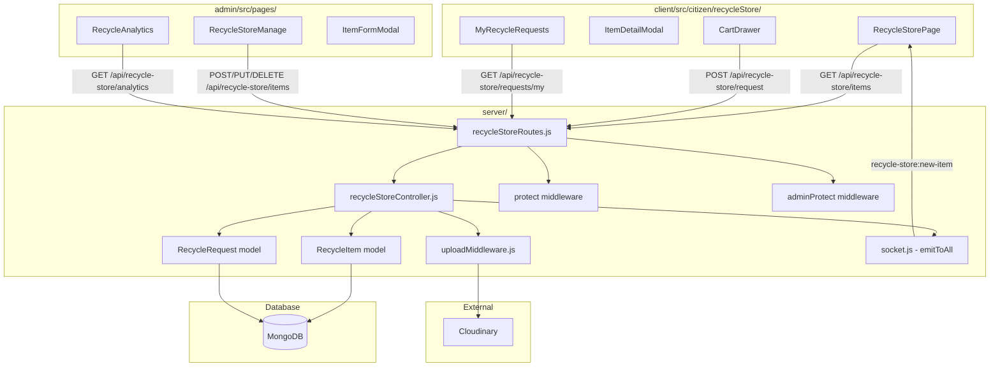
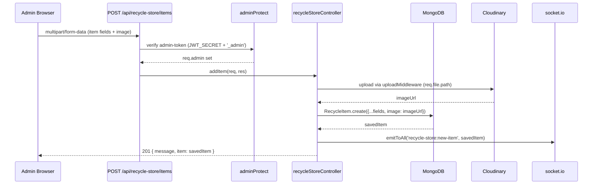
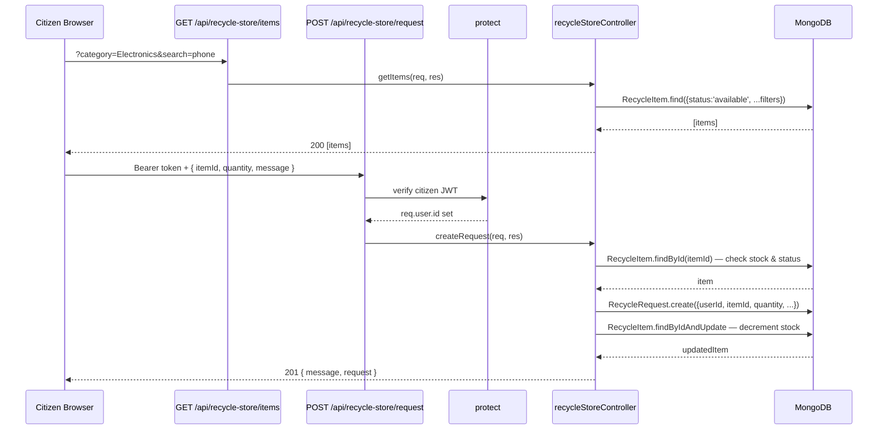

# Design Document: Recycle Store

## Overview

The Recycle Store is a new section of the EcoLoop Green Champion platform that enables admins to list recyclable items for citizens to browse, request, and track. It integrates seamlessly into the existing EcoLoop architecture — reusing the established Mongoose schema patterns, Express controller/route conventions, Cloudinary upload middleware, JWT auth (both `protect` for citizens and `adminProtect` for admins), and the Socket.io `emitToAll` broadcast already wired in `server/socket.js`.

The feature spans three layers: a backend REST API at `/api/recycle-store`, an admin panel section for full CRUD and analytics, and a citizen-facing store page with search, filtering, cart/request flow, and real-time item updates via Socket.io.

## Architecture



## Sequence Diagrams

### Admin Adds an Item



### Citizen Browses and Requests an Item



## Components and Interfaces

### Backend Components

#### RecycleItem Model (`server/models/RecycleItem.js`)

**Purpose**: Mongoose schema for recyclable items listed by admins.

**Interface** (Mongoose schema fields):
```javascript
{
  itemName:    { type: String, required: true, trim: true },
  category:    { type: String, required: true, enum: CATEGORIES },
  description: { type: String, default: '' },
  price:       { type: Number, required: true, min: 0 },
  stock:       { type: Number, required: true, min: 0, default: 0 },
  image:       { type: String, default: '' },          // Cloudinary URL
  status:      { type: String, enum: ['available', 'unavailable'], default: 'available' },
  isFeatured:  { type: Boolean, default: false },
  viewCount:   { type: Number, default: 0 },
  createdAt:   Date,   // timestamps: true
  updatedAt:   Date,
}
```

**Validation Rules**:
- `price` must be ≥ 0
- `stock` must be ≥ 0; when stock reaches 0, status auto-transitions to `unavailable`
- `category` must be one of the 10 fixed values
- `itemName` is required and trimmed

#### RecycleRequest Model (`server/models/RecycleRequest.js`)

**Purpose**: Tracks citizen requests/orders for recycle store items.

**Interface**:
```javascript
{
  userId:    { type: ObjectId, ref: 'User', required: true },
  itemId:    { type: ObjectId, ref: 'RecycleItem', required: true },
  quantity:  { type: Number, required: true, min: 1 },
  status:    { type: String, enum: ['Pending','Approved','Rejected','Completed'], default: 'Pending' },
  message:   { type: String, default: '' },
  createdAt: Date,
  updatedAt: Date,
}
```

#### recycleStoreController (`server/controllers/recycleStoreController.js`)

**Purpose**: Handles all business logic for items and requests.

**Responsibilities**:
- CRUD operations on `RecycleItem` (admin-only writes)
- Stock validation before creating a `RecycleRequest`
- Emitting `recycle-store:new-item` via `socket.emitToAll` on item creation
- Aggregation pipeline for analytics
- Incrementing `viewCount` on item detail fetch

#### recycleStoreRoutes (`server/routes/recycleStoreRoutes.js`)

**Purpose**: Express router wiring auth middleware and controller functions.

**Responsibilities**:
- Apply `adminProtect` to all write/admin routes
- Apply `protect` to citizen request routes
- Apply `upload.single('image')` to item create/update routes

### Frontend Components

#### Admin: `RecycleStoreManage` (`admin/src/pages/RecycleStoreManage.jsx`)

**Purpose**: Full CRUD management page for recycle store items.

**Responsibilities**:
- List all items in a table with edit/delete actions
- Open `ItemFormModal` for add/edit
- Category filter tabs
- Toggle featured/status inline

#### Admin: `RecycleAnalytics` (`admin/src/pages/RecycleAnalytics.jsx`)

**Purpose**: Analytics dashboard for the recycle store.

**Responsibilities**:
- Display stat cards: total items, out-of-stock count, total requests, most-viewed category
- Fetch from `GET /api/recycle-store/analytics`

#### Admin: `ItemFormModal` (component within `RecycleStoreManage`)

**Purpose**: Modal form for creating and editing recycle items.

**Responsibilities**:
- Controlled form with all item fields
- Image preview + Cloudinary upload via `multipart/form-data`
- Client-side validation before submit

#### Citizen: `RecycleStorePage` (`client/src/citizen/recycleStore/RecycleStorePage.jsx`)

**Purpose**: Main browsing page for citizens.

**Responsibilities**:
- Fetch and display items in a card grid
- Search bar (debounced) and category filter pills
- Featured items section at top
- Recently added section
- Socket.io listener for `recycle-store:new-item` to prepend new items in real time
- "Add to Cart" button on each card

#### Citizen: `ItemDetailModal`

**Purpose**: Full item detail view with image, description, price, stock.

**Responsibilities**:
- Display all item fields
- Quantity selector (capped at available stock)
- "Request Item" button → calls `POST /api/recycle-store/request`

#### Citizen: `CartDrawer`

**Purpose**: Slide-out cart showing items the citizen has added before submitting a request.

**Responsibilities**:
- List cart items with quantity controls
- "Submit Request" button → calls `POST /api/recycle-store/request` for each item
- Stock validation feedback

#### Citizen: `MyRecycleRequests` (`client/src/citizen/recycleStore/MyRecycleRequests.jsx`)

**Purpose**: Citizen's request history with status tracking.

**Responsibilities**:
- Fetch from `GET /api/recycle-store/requests/my`
- Display status badges (Pending / Approved / Rejected / Completed)

## Data Models

### CATEGORIES Constant (shared)

```javascript
const CATEGORIES = [
  'Electronics', 'Books', 'Plastic Items', 'Furniture',
  'Metal Scrap', 'Paper Waste', 'Clothes', 'Toys',
  'Appliances', 'Other Recyclable Items'
];
```

### RecycleItem (full schema)

```javascript
// server/models/RecycleItem.js
const mongoose = require('mongoose');

const CATEGORIES = [
  'Electronics', 'Books', 'Plastic Items', 'Furniture',
  'Metal Scrap', 'Paper Waste', 'Clothes', 'Toys',
  'Appliances', 'Other Recyclable Items'
];

const recycleItemSchema = new mongoose.Schema({
  itemName:    { type: String, required: true, trim: true },
  category:    { type: String, required: true, enum: CATEGORIES },
  description: { type: String, default: '' },
  price:       { type: Number, required: true, min: 0 },
  stock:       { type: Number, required: true, min: 0, default: 0 },
  image:       { type: String, default: '' },
  status:      { type: String, enum: ['available', 'unavailable'], default: 'available' },
  isFeatured:  { type: Boolean, default: false },
  viewCount:   { type: Number, default: 0 },
}, { timestamps: true });

recycleItemSchema.index({ category: 1 });
recycleItemSchema.index({ status: 1 });
recycleItemSchema.index({ isFeatured: 1 });
recycleItemSchema.index({ createdAt: -1 });

module.exports = mongoose.model('RecycleItem', recycleItemSchema);
```

### RecycleRequest (full schema)

```javascript
// server/models/RecycleRequest.js
const mongoose = require('mongoose');

const recycleRequestSchema = new mongoose.Schema({
  userId:   { type: mongoose.Schema.Types.ObjectId, ref: 'User', required: true },
  itemId:   { type: mongoose.Schema.Types.ObjectId, ref: 'RecycleItem', required: true },
  quantity: { type: Number, required: true, min: 1 },
  status:   {
    type: String,
    enum: ['Pending', 'Approved', 'Rejected', 'Completed'],
    default: 'Pending'
  },
  message:  { type: String, default: '' },
}, { timestamps: true });

recycleRequestSchema.index({ userId: 1 });
recycleRequestSchema.index({ itemId: 1 });
recycleRequestSchema.index({ status: 1 });
recycleRequestSchema.index({ createdAt: -1 });

module.exports = mongoose.model('RecycleRequest', recycleRequestSchema);
```

## Algorithmic Pseudocode

### Main Algorithm: Add Recycle Item (Admin)

```pascal
ALGORITHM addItem(req, res)
INPUT: req.body (itemName, category, description, price, stock, status, isFeatured),
       req.file (optional image from multer/Cloudinary),
       req.admin (set by adminProtect)
OUTPUT: HTTP 201 with saved item, or HTTP 400/500

BEGIN
  ASSERT req.admin IS NOT NULL  // adminProtect guarantees this

  { itemName, category, description, price, stock, status, isFeatured } ← req.body

  IF itemName IS EMPTY OR category IS EMPTY OR price IS NULL OR stock IS NULL THEN
    RETURN res.status(400).json({ message: 'itemName, category, price, and stock are required.' })
  END IF

  IF category NOT IN CATEGORIES THEN
    RETURN res.status(400).json({ message: 'Invalid category.' })
  END IF

  imageUrl ← req.file ? req.file.path : ''

  item ← AWAIT RecycleItem.create({
    itemName, category, description,
    price: Number(price),
    stock: Number(stock),
    image: imageUrl,
    status: status OR 'available',
    isFeatured: isFeatured === 'true' OR isFeatured === true
  })

  socket.emitToAll('recycle-store:new-item', item)

  RETURN res.status(201).json({ message: 'Item added successfully.', item })
END
```

**Preconditions:**
- `req.admin` is set (adminProtect has run)
- `req.body` contains at minimum `itemName`, `category`, `price`, `stock`
- `category` is one of the 10 fixed values

**Postconditions:**
- A new `RecycleItem` document exists in MongoDB
- All connected Socket.io clients receive `recycle-store:new-item`
- Response is 201 with the saved item

**Loop Invariants:** N/A

---

### Main Algorithm: Get Items (Citizen / Public)

```pascal
ALGORITHM getItems(req, res)
INPUT: req.query (category, search, featured, page, limit)
OUTPUT: HTTP 200 with paginated items array

BEGIN
  { category, search, featured, page = 1, limit = 20 } ← req.query

  query ← { status: 'available' }

  IF category IS NOT EMPTY THEN
    query.category ← category
  END IF

  IF search IS NOT EMPTY THEN
    query.$or ← [
      { itemName:    { $regex: search, $options: 'i' } },
      { description: { $regex: search, $options: 'i' } }
    ]
  END IF

  IF featured = 'true' THEN
    query.isFeatured ← true
  END IF

  skip ← (Number(page) - 1) * Number(limit)

  items ← AWAIT RecycleItem
    .find(query)
    .sort({ createdAt: -1 })
    .skip(skip)
    .limit(Number(limit))

  total ← AWAIT RecycleItem.countDocuments(query)

  RETURN res.status(200).json({ items, total, page: Number(page), limit: Number(limit) })
END
```

**Preconditions:**
- Query params are optional; defaults applied if absent
- `limit` is capped at 100 to prevent abuse

**Postconditions:**
- Returns only items with `status: 'available'`
- Pagination metadata included in response

---

### Main Algorithm: Create Request (Citizen)

```pascal
ALGORITHM createRequest(req, res)
INPUT: req.body (itemId, quantity, message), req.user.id (from protect)
OUTPUT: HTTP 201 with request, or HTTP 400/404/500

BEGIN
  ASSERT req.user IS NOT NULL  // protect guarantees this

  { itemId, quantity, message } ← req.body

  IF itemId IS EMPTY OR quantity IS NULL OR quantity < 1 THEN
    RETURN res.status(400).json({ message: 'itemId and quantity (≥1) are required.' })
  END IF

  item ← AWAIT RecycleItem.findById(itemId)

  IF item IS NULL THEN
    RETURN res.status(404).json({ message: 'Item not found.' })
  END IF

  IF item.status = 'unavailable' THEN
    RETURN res.status(400).json({ message: 'Item is currently unavailable.' })
  END IF

  IF item.stock < quantity THEN
    RETURN res.status(400).json({ message: `Only ${item.stock} units available.` })
  END IF

  request ← AWAIT RecycleRequest.create({
    userId:   req.user.id,
    itemId,
    quantity: Number(quantity),
    message:  message OR '',
    status:   'Pending'
  })

  AWAIT RecycleItem.findByIdAndUpdate(itemId, {
    $inc: { stock: -Number(quantity) }
  })

  // Auto-mark unavailable if stock hits 0
  IF item.stock - Number(quantity) <= 0 THEN
    AWAIT RecycleItem.findByIdAndUpdate(itemId, { status: 'unavailable' })
  END IF

  RETURN res.status(201).json({ message: 'Request submitted successfully.', request })
END
```

**Preconditions:**
- `req.user.id` is set by `protect` middleware
- `itemId` references an existing `RecycleItem`
- `quantity` ≥ 1

**Postconditions:**
- A `RecycleRequest` document is created with status `Pending`
- `RecycleItem.stock` is decremented by `quantity`
- If resulting stock ≤ 0, item status becomes `unavailable`

**Loop Invariants:** N/A

---

### Main Algorithm: Analytics (Admin)

```pascal
ALGORITHM getAnalytics(req, res)
INPUT: req.admin (set by adminProtect)
OUTPUT: HTTP 200 with analytics object

BEGIN
  totalItems      ← AWAIT RecycleItem.countDocuments({})
  outOfStock      ← AWAIT RecycleItem.countDocuments({ stock: 0 })
  totalRequests   ← AWAIT RecycleRequest.countDocuments({})

  categoryAgg ← AWAIT RecycleItem.aggregate([
    { $group: { _id: '$category', count: { $sum: 1 }, views: { $sum: '$viewCount' } } },
    { $sort: { views: -1 } },
    { $limit: 1 }
  ])

  mostViewedCategory ← categoryAgg[0]?._id OR 'N/A'

  RETURN res.status(200).json({
    totalItems,
    outOfStock,
    totalRequests,
    mostViewedCategory
  })
END
```

## Key Functions with Formal Specifications

### `addItem(req, res)`

```javascript
// POST /api/recycle-store/items — adminProtect + upload.single('image')
async function addItem(req, res)
```

**Preconditions:**
- `req.admin` is defined (adminProtect ran successfully)
- `req.body.itemName`, `req.body.category`, `req.body.price`, `req.body.stock` are present
- `req.body.category` ∈ CATEGORIES

**Postconditions:**
- New `RecycleItem` persisted in MongoDB
- `socket.emitToAll('recycle-store:new-item', item)` called exactly once
- Returns HTTP 201 with `{ message, item }`

---

### `getItems(req, res)`

```javascript
// GET /api/recycle-store/items — public (no auth required)
async function getItems(req, res)
```

**Preconditions:**
- Query params `category`, `search`, `featured`, `page`, `limit` are all optional

**Postconditions:**
- Returns only items where `status === 'available'`
- Results sorted by `createdAt` descending
- Response includes `{ items, total, page, limit }`

---

### `updateItem(req, res)`

```javascript
// PUT /api/recycle-store/items/:id — adminProtect + upload.single('image')
async function updateItem(req, res)
```

**Preconditions:**
- `req.admin` is defined
- `req.params.id` is a valid MongoDB ObjectId
- Item with that id exists

**Postconditions:**
- `RecycleItem` document updated with provided fields
- If new image uploaded, old Cloudinary URL replaced
- Returns HTTP 200 with updated item

---

### `deleteItem(req, res)`

```javascript
// DELETE /api/recycle-store/items/:id — adminProtect
async function deleteItem(req, res)
```

**Preconditions:**
- `req.admin` is defined
- Item with `req.params.id` exists

**Postconditions:**
- `RecycleItem` document removed from MongoDB
- Returns HTTP 200 with `{ message }`

---

### `createRequest(req, res)`

```javascript
// POST /api/recycle-store/request — protect
async function createRequest(req, res)
```

**Preconditions:**
- `req.user.id` is defined (protect ran)
- `req.body.itemId` references an existing `RecycleItem`
- `req.body.quantity` ≥ 1
- `item.status === 'available'` AND `item.stock >= quantity`

**Postconditions:**
- `RecycleRequest` created with `status: 'Pending'`
- `item.stock` decremented by `quantity`
- If `item.stock - quantity <= 0`, `item.status` set to `'unavailable'`

---

### `getAnalytics(req, res)`

```javascript
// GET /api/recycle-store/analytics — adminProtect
async function getAnalytics(req, res)
```

**Preconditions:**
- `req.admin` is defined

**Postconditions:**
- Returns `{ totalItems, outOfStock, totalRequests, mostViewedCategory }`
- All counts are non-negative integers

## Example Usage

### Admin: Add Item (fetch)

```javascript
// admin/src/pages/RecycleStoreManage.jsx
const addItem = async (formData) => {
  const token = localStorage.getItem('admin-token');
  const res = await fetch(`${API}/api/recycle-store/items`, {
    method: 'POST',
    headers: { Authorization: `Bearer ${token}` },
    body: formData,  // FormData with image file
  });
  const data = await res.json();
  if (res.ok) setItems(prev => [data.item, ...prev]);
};
```

### Citizen: Browse Items with Filter

```javascript
// client/src/citizen/recycleStore/RecycleStorePage.jsx
const fetchItems = async (category = '', search = '') => {
  const params = new URLSearchParams();
  if (category) params.set('category', category);
  if (search)   params.set('search', search);
  const res = await fetch(`${API}/api/recycle-store/items?${params}`);
  const data = await res.json();
  setItems(data.items);
};
```

### Citizen: Real-time Socket Listener

```javascript
// client/src/citizen/recycleStore/RecycleStorePage.jsx
useEffect(() => {
  socket.on('recycle-store:new-item', (newItem) => {
    setItems(prev => [newItem, ...prev]);
  });
  return () => socket.off('recycle-store:new-item');
}, []);
```

### Citizen: Submit Request

```javascript
// client/src/citizen/recycleStore/ItemDetailModal.jsx
const submitRequest = async () => {
  const token = localStorage.getItem('token');
  const res = await fetch(`${API}/api/recycle-store/request`, {
    method: 'POST',
    headers: {
      'Content-Type': 'application/json',
      Authorization: `Bearer ${token}`,
    },
    body: JSON.stringify({ itemId: item._id, quantity, message }),
  });
  const data = await res.json();
  if (res.ok) toast.success('Request submitted!');
  else        toast.error(data.message);
};
```

## Error Handling

### Error Scenario 1: Stock Exhausted

**Condition**: Citizen attempts to request more units than available stock, or item stock is 0.
**Response**: HTTP 400 `{ message: "Only N units available." }` or `{ message: "Item is currently unavailable." }`
**Recovery**: Frontend shows the error message inline; citizen adjusts quantity or selects a different item.

### Error Scenario 2: Invalid Category

**Condition**: Admin submits an item with a category not in the fixed CATEGORIES enum.
**Response**: HTTP 400 `{ message: "Invalid category." }`
**Recovery**: Frontend validates category client-side using the same CATEGORIES array before submission.

### Error Scenario 3: Unauthorized Admin Action

**Condition**: Request to a write endpoint without a valid admin JWT.
**Response**: HTTP 401 `{ message: "Not authorized." }` from `adminProtect`.
**Recovery**: Admin frontend redirects to `/admin/login` when a 401 is received.

### Error Scenario 4: Item Not Found

**Condition**: `PUT`, `DELETE`, or request creation references a non-existent item ID.
**Response**: HTTP 404 `{ message: "Item not found." }`
**Recovery**: Frontend removes the stale item from local state and shows a toast error.

### Error Scenario 5: Image Upload Failure

**Condition**: Cloudinary upload fails (network error, size limit exceeded).
**Response**: Multer/Cloudinary throws; controller catches and returns HTTP 500.
**Recovery**: Frontend shows error toast; item is not saved (atomic — no partial writes).

## Testing Strategy

### Unit Testing Approach

Unit tests cover pure logic functions: stock validation, category enum checks, analytics aggregation result mapping, and query-builder logic in `getItems`. Tests use Jest with `mongodb-memory-server` for in-process MongoDB.

Key test cases:
- `createRequest` rejects when `quantity > item.stock`
- `createRequest` sets item status to `unavailable` when stock reaches 0
- `getItems` returns only `status: 'available'` items regardless of query params
- `addItem` emits `recycle-store:new-item` socket event exactly once

### Property-Based Testing Approach

**Property Test Library**: fast-check (already available in the JS ecosystem; no new install needed)

Property tests focus on the invariants that must hold across all valid inputs:
- For any valid item creation, the item is retrievable and matches the input
- For any request with valid quantity, stock decrements correctly
- For any combination of search/category filters, only available items are returned

### Integration Testing Approach

Integration tests use Supertest against the Express app with a test MongoDB instance:
- Full request lifecycle: add item → citizen requests → stock decrements → status updates
- Admin analytics reflect correct counts after CRUD operations
- Socket.io emission verified with a test socket client

## Performance Considerations

- MongoDB indexes on `category`, `status`, `isFeatured`, and `createdAt` ensure fast filtered queries even with large item catalogs.
- The `getItems` endpoint is paginated (default 20 items/page) to prevent large payload responses.
- `viewCount` increments use `$inc` atomic updates — no read-modify-write race conditions.
- The citizen store page debounces the search input (300ms) to avoid excessive API calls.

## Security Considerations

- All write operations (add/edit/delete items, update request status) are protected by `adminProtect`, which verifies a separate JWT secret (`JWT_SECRET + '_admin'`), preventing citizen tokens from being used for admin actions.
- Citizen request creation is protected by `protect` middleware; `req.user.id` is always taken from the decoded JWT, never from the request body, preventing user impersonation.
- Stock validation is enforced server-side — client-side checks are UX only.
- Image uploads are routed through the existing `uploadMiddleware.js` which enforces 5MB size limit and restricts to jpg/jpeg/png formats.

## Dependencies

All dependencies are already installed in the project. No new packages required.

| Dependency | Already In | Usage |
|---|---|---|
| `mongoose` | `server/package.json` | RecycleItem and RecycleRequest models |
| `express` | `server/package.json` | Route definitions |
| `multer` + `multer-storage-cloudinary` | `server/package.json` | Image upload via existing `uploadMiddleware.js` |
| `cloudinary` | `server/package.json` | Image storage |
| `socket.io` | `server/package.json` | Real-time new-item broadcast via `emitToAll` |
| `jsonwebtoken` | `server/package.json` | Auth via existing `protect` and `adminProtect` |
| `react-icons` | `client/package.json` + `admin/package.json` | UI icons |
| `tailwindcss` | `client/package.json` + `admin/package.json` | Styling |

## Correctness Properties

*A property is a characteristic or behavior that should hold true across all valid executions of a system — essentially, a formal statement about what the system should do. Properties serve as the bridge between human-readable specifications and machine-verifiable correctness guarantees.*

### Property 1: Available-only browsing

For any state of the database containing a mix of available and unavailable RecycleItems, every item returned by `GET /api/recycle-store/items` SHALL have `status === 'available'` — no unavailable item SHALL ever appear in the citizen browse results.

**Validates: Requirements 6.1**

### Property 2: Filter correctness

For any combination of `category`, `search`, and `featured` query parameters, every item in the response SHALL satisfy all supplied filter conditions simultaneously: matching category (if provided), matching itemName or description via case-insensitive regex (if search provided), and having `isFeatured === true` (if featured=true provided).

**Validates: Requirements 6.2, 6.3, 6.4**

### Property 3: Request creation and stock decrement invariant

For any valid citizen request with quantity Q against a RecycleItem with stock S where Q ≤ S and status is `'available'`, after the request is successfully created: a RecycleRequest document with `status: 'Pending'` SHALL exist, and the RecycleItem's stock SHALL equal S − Q.

**Validates: Requirements 8.1, 8.2**

### Property 4: Stock exhaustion triggers unavailability

For any RecycleItem with stock S, if a citizen successfully requests exactly S units (causing stock to reach 0), the RecycleItem's `status` SHALL be `'unavailable'` after the request is processed.

**Validates: Requirements 8.3**

### Property 5: Request rejection when stock insufficient or item unavailable

For any citizen request where the requested quantity exceeds the item's current stock, OR where the item's status is `'unavailable'`, the system SHALL return an HTTP 4xx error and the item's stock SHALL remain unchanged.

**Validates: Requirements 8.4, 8.5**

### Property 6: Analytics counts consistency

For any state of the database, the analytics response SHALL satisfy all of the following simultaneously: `totalItems` equals the count of all RecycleItem documents, `outOfStock` equals the count of RecycleItems where `stock === 0`, `totalRequests` equals the count of all RecycleRequest documents, and `outOfStock ≤ totalItems`.

**Validates: Requirements 11.2, 11.3, 11.4**

### Property 7: Socket broadcast on item creation

For any successful admin item creation (HTTP 201 response), the socket event `recycle-store:new-item` SHALL be emitted exactly once with the newly created item as payload, and the payload SHALL contain the same `_id` as the created item.

**Validates: Requirements 3.3**

### Property 8: Citizen request data isolation

For any citizen with userId U, the response from `GET /api/recycle-store/requests/my` SHALL contain only RecycleRequest documents where `userId === U` — no requests belonging to other citizens SHALL be returned.

**Validates: Requirements 9.1**

### Property 9: Category enum enforcement

For any string value not in the CATEGORIES list submitted as the `category` field in a POST or PUT request to `/api/recycle-store/items`, the Item_Controller SHALL return HTTP 400 and no RecycleItem document SHALL be created or modified.

**Validates: Requirements 1.2, 3.5**

### Property 10: UI availability gating

For any RecycleItem where `status === 'unavailable'` or `stock === 0`, the Store_Page SHALL render the request/add-to-cart action in a disabled state, preventing citizen interaction with that action.

**Validates: Requirements 8.8**
